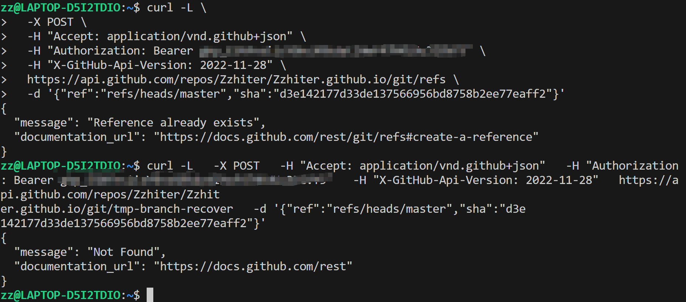
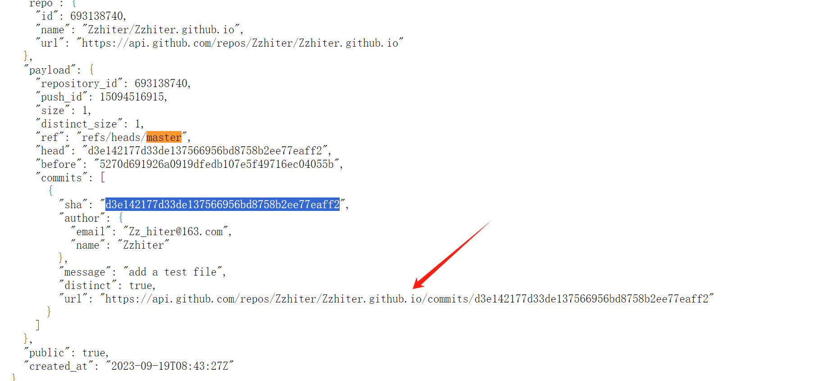
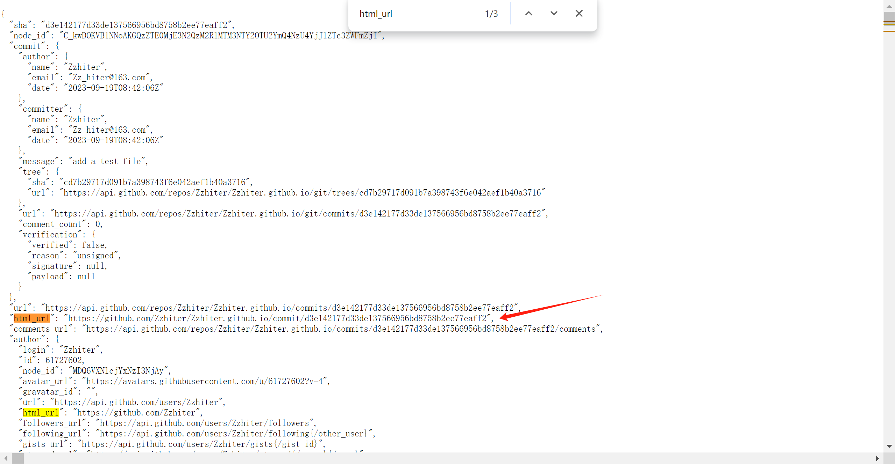
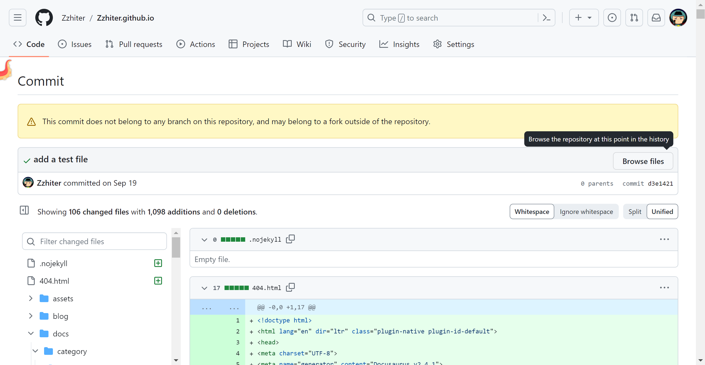
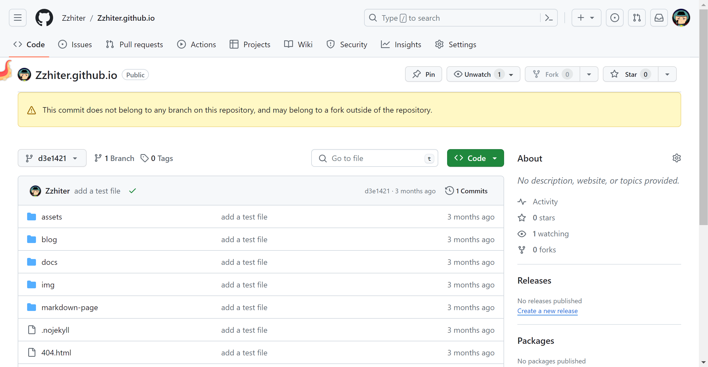
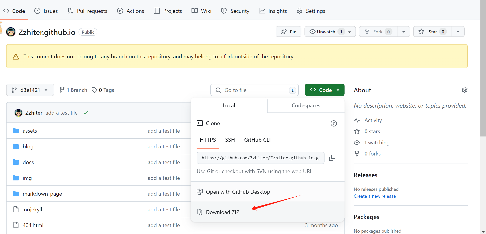

## 背景

看到有很多教程说，可以本地仓库回退到之前的 commit，恢复 GitHub 的 remote 仓库的，但是我遇到的情况是，我本地这个仓库是新建的，只有一次 commit 记录，我是直接 push -f 把 remote 的仓库全冲了。。。本地根本没法恢复。

于是在网上搜索，只找到两篇相关的文章，参考这个老哥的：

[https://www.boris1993.com/rescuing-my-github-repo-from-force-push.html](https://www.boris1993.com/rescuing-my-github-repo-from-force-push.html)

这个老师是参考的这个老哥：[https://gist.github.com/agarwalparas/d355a950148702cc7ba82abc4d1943bf](https://gist.github.com/agarwalparas/d355a950148702cc7ba82abc4d1943bf)

我按照第二个老哥的方法去试，又按照 github 的官方 doc 修改 API 的参数，但是还是不行



下面总结一下怎么恢复

## 找到当时的 commit 的信息

首先，要通过 `https://api.github.com/repos/:owner/:repo/events` 这个 API 找到上次提交的 sha。

```go
[
  {
    "id": "34280684189",
    "type": "PushEvent",
    "actor": {
      "id": 61727602,
      "login": "YOUR_NAME",
      "display_login": "YOUR_NAME",
      "gravatar_id": "",
      "url": "https://api.github.com/users/YOUR_NAME",
      "avatar_url": "https://avatars.githubusercontent.com/u/61727602?"
    },
    "repo": {
      "id": 693138740,
      "name": "YOUR_NAME/YOUR_NAME.github.io",
      "url": "https://api.github.com/repos/YOUR_NAME/YOUR_NAME.github.io"
    },
    "payload": {
      "repository_id": 693138740,
      "push_id": 16338237949,
      "size": 1,
      "distinct_size": 1,
      "ref": "refs/heads/master",
      "head": "19709fd69b846679a57edd1c0ee8ae0f199302b3",
      "before": "d3e142177d33de137566956bd8758b2ee77eaff2",
      "commits": [
        {
          "sha": "19709fd69b846679a57edd1c0ee8ae0f199302b3",
          "author": {
            "email": "xxxx@163.com",
            "name": "YOUR_NAME"
          },
          "message": "doc: add new file",
          "distinct": true,
          "url": "https://api.github.com/repos/YOUR_NAME/YOUR_NAME.github.io/commits/19709fd69b846679a57edd1c0ee8ae0f199302b3"
        }
      ]
    },
    "public": true,
    "created_at": "2023-12-19T13:32:35Z"
  },
  {
    "id": "31933061999",
    "type": "PushEvent",
    "actor": {
      "id": 61727602,
      "login": "YOUR_NAME",
      "display_login": "YOUR_NAME",
      "gravatar_id": "",
      "url": "https://api.github.com/users/YOUR_NAME",
      "avatar_url": "https://avatars.githubusercontent.com/u/61727602?"
    },
    "repo": {
      "id": 693138740,
      "name": "YOUR_NAME/YOUR_NAME.github.io",
      "url": "https://api.github.com/repos/YOUR_NAME/YOUR_NAME.github.io"
    },
    "payload": {
      "repository_id": 693138740,
      "push_id": 15094516915,
      "size": 1,
      "distinct_size": 1,
      "ref": "refs/heads/master",
      "head": "d3e142177d33de137566956bd8758b2ee77eaff2",
      "before": "5270d691926a0919dfedb107e5f49716ec04055b",
      "commits": [
        {
          "sha": "d3e142177d33de137566956bd8758b2ee77eaff2",
          "author": {
            "email": "xxxx@163.com",
            "name": "YOUR_NAME"
          },
          "message": "add a test file",
          "distinct": true,
          "url": "https://api.github.com/repos/YOUR_NAME/YOUR_NAME.github.io/commits/d3e142177d33de137566956bd8758b2ee77eaff2"
        }
      ]
    },
    "public": true,
    "created_at": "2023-09-19T08:43:27Z"
  }
]
```

可以看到，我这边只有两次提交记录，最上面的是最新一次的，冲掉了下面的 commit。

因此，我要恢复到的那个 commit 是：d3e142177d33de137566956bd8758b2ee77eaff2。

直接找到当时那个 commit 对应的 push 信息，访问下面这个 URL。



## 找到 commit 信息里的 html_url

得到的数据很长，但是我们找到关键信息：

"html_url": "[https://github.com/YOUR_NAME/YOUR_NAME.github.io/commit/d3e142177d33de137566956bd8758b2ee77eaff2](https://github.com/YOUR_NAME/YOUR_NAME.github.io/commit/d3e142177d33de137566956bd8758b2ee77eaff2)"



直接访问这个 URL，找到当时的 commit 记录：



## 找到当时的仓库所有文件的快照

点击右边的 Browse files，Browse the repository at this point in the history。直接找到了当时的仓库快照：



下载当时的代码：



这下就都找回来了！

其实主要还是 Github 存储了所有的 commit 信息，因此，就算是我们本地有丢失，通过访问 Github 的 OpenAPI，也是可以想办法找到的！

虚惊一场。
