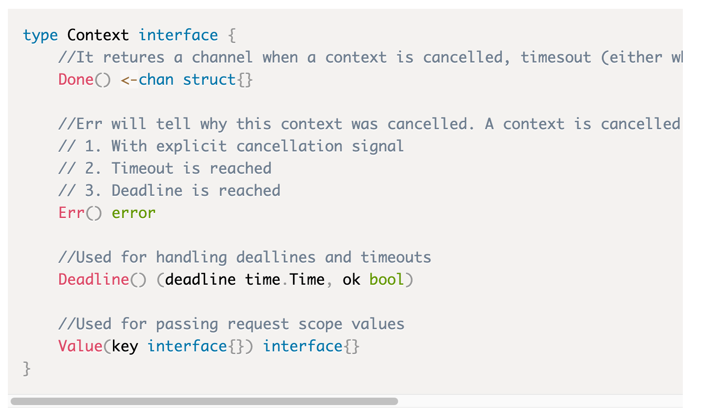

# 引言

## 定义

Context 是 Go 提供的一个包。让我们首先了解一些已经存在的问题，以及 context 包试图解决的问题。

## 问题引出

- 假设您启动了一个函数，并且需要将一些公共参数传递给下游函数。您不能将这些公共参数分别作为参数传递给所有下游函数。
- 你启动了一个 goroutine，它又启动了更多 goroutine，依此类推。假设不再需要您正在执行的任务。那么如何通知所有子 goroutine 优雅退出，从而释放资源
- 任务应在指定的超时（例如 2 秒）内完成。如果不是，它应该优雅地退出或返回。
- 任务应该在截止日期内完成，例如应该在下午 5 点之前结束。如果没有完成那么它应该优雅地退出并返回

如果您注意到上述所有问题都非常适用于 HTTP 请求，但这些问题也适用于许多不同的领域。

对于 Web HTTP 请求，需要在客户端断开连接时取消请求，或者必须在指定的超时时间内完成请求，并且请求范围值（例如 request_id）需要可供所有下游函数使用。

## 何时使用（使用场景）

总而言之，有两个功能：

1. 并发协调
2. 携带信息并传递，用于链路追踪

具体场景：

- 向下游传递数据。例如。 HTTP 请求创建一个 request_id、request_user，需要将其传递给所有下游函数以进行分布式跟踪（distributed tracing，比如 logid 等信息）。
- 当你想**中途**停止操作时 - HTTP 请求应停止，因为客户端断开了连接
- 当您想要在**开始后的指定时间内**停止操作时，即超时 – 例如，HTTP 请求应在 2 秒内完成，否则应中止。
- 当您想在**某个时间之前**停止操作时 – 例如。一个 cron（定时任务）正在运行，如果未完成则需要在 5 分钟内中止。

# **Context Interface**

理解 Context 的核心是了解 Context 接口



# 创建新的 **Context**

## **context.Background()**

context 包函数 Background()返回一个空的 Context，它实现了 Context 接口。

- 它没有值
- 它永远不会被取消
- 它没有截止日期

那么如何使用 context.Background()？context.Background() 是由它派生的所有 context 的根。下面的内容会更加清楚

## **context.ToDo()**

- context 包中的 ToDo 函数返回一个空的 Context。当周围函数尚未传递 context 并且想要使用 context 作为当前函数中的占位符并计划在不久的将来添加实际 context 时，将使用此 context。将其添加为占位符的用途之一是它有助于在静态代码分析工具中进行验证。
- 它也是一个空的 Context，与 context.Background() 相同

上述两种方法描述了一种创建新 Context 的方式。从这些中可以衍生出更多 Context。这就是 Context tree 发挥作用的地方。

# **Context Tree**

在理解 context tree 之前，请确保它是在使用 context 时在后台隐式创建的。你会发现 go context 包本身没有提及这个概念。

每当您使用 context 时，从 context.Background() 获得的空 context 就是所有 context 的根。 context.ToDo() 的作用也类似于根 context，但如上所述，它更像是供将来使用的 context 占位符。

这个空 context 没有任何功能，我们可以从中派生出一个新的 context 来增加功能。基本上，一个新的 context 是通过封装一个已经存在的不可变 context 并添加额外信息而创建的。让我们看看创建 context 树的示例

## **Two level tree**

```go
rootCtx := context.Background()
childCtx := context.WithValue(rootCtx, "msgId", "someMsgId")
```

在上面：

- rootCtx 是没有任何功能的空 context
- childCtx 派生自 rootCtx，具有存储请求范围值的功能。在上面的示例中，它存储 {"msgId" : "someMsgId"} 的键值对

## **Three level tree**

```go
rootCtx := context.Background()
childCtx := context.WithValue(rootCtx, "msgId", "someMsgId")
childOfChildCtx, cancelFunc := context.WithCancel(childCtx)
```

在上面：

- rootCtx 是没有任何功能的空 context
- childCtx 派生自 rootCtx，具有存储请求范围值的功能。在上面的示例中，它存储 {"msgId" : "someMsgId"} 的键值对
- childOfChildCtx 派生自 childCtx 。它具有存储请求范围值的功能，并且还具有触发取消信号的功能。 cancelFunc 可用于触发取消信号（相当于既有 WithValue，又有 WithCancel）

## **Multi-level tree**

```go
rootCtx := context.Background()
childCtx1 := context.WithValue(rootCtx, "msgId", "someMsgId")
childCtx2, cancelFunc := context.WithCancel(childCtx1)
childCtx3 := context.WithValue(rootCtx, "user_id", "some_user_id)
```

- rootCtx 是没有任何功能的空 context
- childCtx1 源自 rootCtx，具有存储请求作用域值的功能。在上例中，它存储了 {"msgId" : "someMsgId"} 的键值对。
- childCtx2 由 childCtx1 派生而来。它具有触发取消信号的功能。cancelFunc 可用于触发取消信号
- childCtx3 源自 rootCtx。它具有存储当前用户信息的功能。

上面的三层树如下所示。


由于它是一棵树，因此也可以为特定节点创建更多子节点。例如，我们可以从 childCtx1 派生出新的 context childCtx4。

```go
childCtx4 := context.WithValue(childCtx1, "current_time", "some_time)
```

添加了上述节点的树如下所示：

此时此刻，你可能还不清楚如何使用 WithValue() 或 WithCancel() 函数。现在只需了解，每当使用 context 时，都会创建一个 context 树，其中 root 作为 emptyCtx。随着我们继续前进，这些功能将会变得清晰。

# **从 Context 派生**

派生 context 可以通过 4 种方式创建：

- 传递请求作用域（request-scoped）的值 —— 使用 context 包的 WithValue() 函数
- 使用取消信号 —— 使用 context 包的 WithCancel() 函数
- 有截止日期 —— 使用 context 包的 WithDeadine() 函数
- 有超时 - 使用 context 包的 WithTimeout() 函数

让我们详细了解上面的每一项。

## **context.WithValue()**

用于传递请求范围（request-scoped）的值。该函数的完整签名是：

```go
withValue(parent Context, key, val interface{}) (ctx Context)
```

它接受父 context、键、值并返回派生 context。该派生 context 具有与值关联的键。这里的父 context 可以是 context.Background() 或任何其他 context。此外，从该 context 派生的任何 context 都将具有该值。

```go
// Root Context
ctxRoot := context.Background() - #Root context 

// Below ctxChild has acess to only one pair {"a":"x"}
ctxChild := context.WithValue(ctxRoot, "a", "x") 

// Below ctxChildofChild has access to both pairs {"a":"x", "b":"y"} as it is derived from ctxChild
ctxChildofChild := context.WithValue(ctxChild, "b", "y")
```

### 例子

withValue() 的完整工作示例。在下面的示例中，我们为每个传入请求注入一个 msgId。

- inejctMsgID 是一个网络 HTTP 中间件函数，用于填充 context 中的“msgID”字段
- HelloWorld 是 api“localhost:8080/welcome”的处理函数，它从 context 中获取此 msgID 并将其作为响应标头发送回来

```go
package main

import ("context""net/http""github.com/google/uuid")

func main() {
    helloWorldHandler := http.HandlerFunc(HelloWorld)
    http.Handle("/welcome", inejctMsgID(helloWorldHandler))
    http.ListenAndServe(":8080", nil)
} 

// HelloWorld hellow world handler
func HelloWorld(w http.ResponseWriter, r *http.Request) {
    msgID := ""
    if m := r.Context().Value("msgId"); m != nil {
        if value, ok := m.(string); ok {
            msgID = value
        }
    }
    w.Header().Add("msgId", msgID)
    w.Write([]byte("Hello, world"))
}

func inejctMsgID(next http.Handler) http.Handler {
    return http.HandlerFunc(
        func(w http.ResponseWriter, r *http.Request) {
        msgID := uuid.New().String()
        ctx := context.WithValue(r.Context(), "msgId", msgID) // 设置
        req := r.WithContext(ctx) // 创建一个包含新context的请求副本
        next.ServeHTTP(w, req)}
        )
}
```

运行上述程序后，只需对上述请求进行 curl 调用

```go
curl -v http://localhost/welcome
```

这里将给出回应。请注意响应标头中填充的 MsgId。 insertMsgId 函数充当中间件，并将唯一的 msgId 注入到请求 context 中。

```go
curl -v http://localhost:8080/welcome
*   Trying ::1...
* TCP_NODELAY set
* Connected to localhost (::1) port 8080 (#0)
> GET /do HTTP/1.1
> Host: localhost:8080
> User-Agent: curl/7.54.0
> Accept: */*
> 
< HTTP/1.1 200 OK
< Msgid: a03ff1d4-1464-42e5-a0a8-743c5af29837
< Date: Mon, 23 Dec 2019 16:51:01 GMT
< Content-Length: 12
< Content-Type: text/plain; charset=utf-8
< 
* Connection #0 to host localhost left intact
```

## **context.WithCancel()**

用于取消信号。以下是 WithCancel() 函数的签名

```go
func WithCancel(parent Context) (ctx Context, cancel CancelFunc)
```

context.WithCancel() 函数返回两个东西：

- 带有新完成通道的 parentContext 的副本。
- 取消函数，调用时会关闭此完成通道

只有该 context 的创建者才应调用取消函数。强烈不建议传递取消函数。让我们通过一个例子来理解 withCancel。

### 例子

```go
package main

import (
    "context"
    "fmt"
    "time"
)

func main() {
    ctx: = context.Background()
    cancelCtx,cancelFunc: = context.WithCancel(ctx)
    go task(cancelCtx)
    time.Sleep(time.Second * 3)
    cancelFunc()
    time.Sleep(time.Second * 1)
}

func task(ctx context.Context) {
    i: = 1
    for {
        select {
            case <-ctx.Done(): // 当上面运行了cancelFunc这个函数之后，会向ctx.Done()返回的chan里面，写struct{}
                fmt.Println("Gracefully exit")
                fmt.Println(ctx.Err()) // 这里会输出context canceled
                return
            default:
                fmt.Println(i)
                time.Sleep(time.Second * 1)
                i++
        }
    }
}
```

输出：

```go
123
Gracefully exit
context canceled
```

在上面的程序中：

一旦调用 cancelFunc，任务函数就会正常退出。一旦调用 cancelFunc，错误字符串就会被 context 包设置为“context 已取消”。这就是为什么 ctx.Err() 的输出是“context 已取消”

## **context.WithTimeout()**

用于基于时间的取消。函数的签名是：

```go
func WithTimeout(parent Context, timeout time.Duration) (Context, CancelFunc)
```

context.WithTimeout() 函数将

- 将返回带有新完成通道的 parentContext 副本。
- 接受超时时间，超时后该 done 通道将关闭，context 将被取消。（超时时间）
- 在超时前需要取消 context 时可以调用的取消函数。（如果想提前结束，也给你返回一个 cancelFunc 供你使用）

### 例子

```go
package main

import (
    "context"
    "fmt"
    "time"
)

func main() {
    ctx: = context.Background()
    cancelCtx, cancel: = context.WithTimeout(ctx, time.Second * 3)
    defer cancel()
    go task1(cancelCtx)
    time.Sleep(time.Second * 4)
}

func task1(ctx context.Context) {
    i: = 1
    for {
        select {
            case <-ctx.Done():
                fmt.Println("Gracefully exit")
                fmt.Println(ctx.Err())
                return
            default:
                fmt.Println(i)
                time.Sleep(time.Second * 1)
                i++
        }
    }
}
```

输出：

```go
1
2
3
Gracefully exit
context deadline exceeded
```

在上面的程序中

一旦 3 秒超时完成，任务函数将优雅退出。错误字符串被 context 包设置为“超出 context 截止时间”。这就是为什么 ctx.Err() 的输出是“超出 context 截止日期”

## **context.WithDeadline()**

用于基于截止日期的取消。函数的签名是

```go
func WithDeadline(parent Context, d time.Time) (Context, CancelFunc)
```

context.WithDeadline() 函数

- 将返回带有新完成通道的 parentContext 的副本。
- 接受截止日期，之后此完成的通道将关闭并且 context 将被取消
- 一个取消函数，可以在达到截止日期之前取消 context 的情况下调用。

### 例子

```go
package main

import (
    "context"
    "fmt"
    "time"
)

func main() {
    ctx := context.Background()
    cancelCtx, cancel := context.WithDeadline(ctx, time.Now().Add(time.Second*5))
    defer cancel()
    go task(cancelCtx)
    time.Sleep(time.Second * 6)
}

func task(ctx context.Context) {
    i := 1
    for {
        select {
        case <-ctx.Done():
            fmt.Println("Gracefully exit")
            fmt.Println(ctx.Err())
            return
        default:
            fmt.Println(i)
            time.Sleep(time.Second * 1)
            i++
        }
    }
}
```

输出：

```go
12345
Gracefully exit
context deadline exceeded
```

在上面的程序中

一旦 5 秒的超时完成，任务函数将正常退出，因为我们给出了 Time.now() + 5 秒的截止时间。错误字符串被 context 包设置为“超出 context 截止时间”。这就是为什么 ctx.Err() 的输出是“超出 context 截止日期”

# **What We Learned**

**How to create the context**:

- Using context.Backgroun()
- Using context.Todo()

**Context Tree**

**Deriving a new context**

- context.WithValue()
- context.WithCancel()
- context.WithTimeout()
- contxt.WithDeadline()

# 最佳实践和注意事项

以下是您在使用 context 时可以遵循的最佳实践列表。

- Do not store a context within a struct type
- context 应该贯穿你的程序。例如，在 HTTP 请求的情况下，可以为每个传入请求创建一个新的 context，该 context 可用于保存 request_id 或在 context 中放置一些常用信息，例如当前登录的用户，这可能对该特定请求有用。
- 始终将 context 作为函数的第一个参数传递。
- 每当您不确定是否使用 context 时，最好使用 context.ToDo() 作为占位符。
- 只有父 Goroutine 或函数才应该取消 context。因此，不要将 cancelFunc 传递给下游 goroutine 或函数。 Golang 将允许您将 cancelFunc 传递给子 goroutine，但这不是推荐的做法
