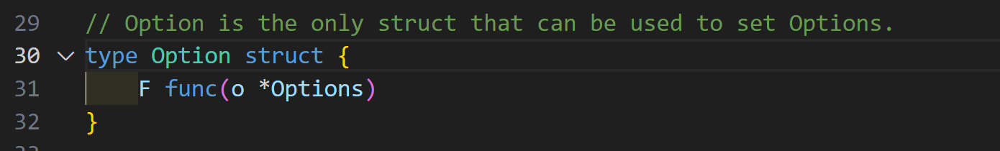
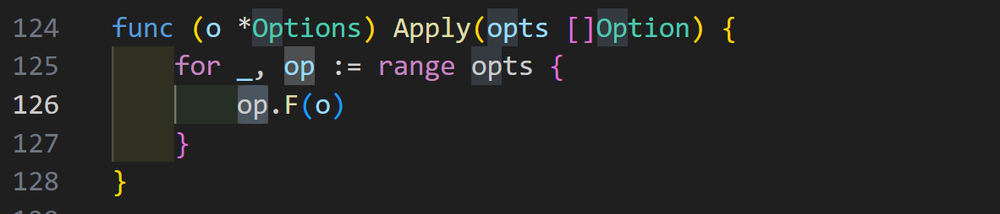

# Functional Options Pattern

最近在看 Hertz 的源码，发现也是用了这个模式，不过是定义成了：



调用的时候需要多一层：



其实是一样的，甚至可以定义一个别名：

```go
type Option func(*Options)
```

这样就不用额外搞一个结构体了。

下面回顾一下这个模式，应该对于支持函数式的编程语言都适用。

The Go (Golang) Functiona Options Pattern is a way, a pattern of structuring your structs in Go by designing a very expressive and flexible set of APIs that will help with the configuration and initialisation of your struct. Let’s have a look at a code snippet and let’s see what options we can use and how and when the functional options pattern can be useful for us.

# Example: Building a server package in Go

In this example we look at a server package in Go, but it could be anything that is used by a third party client, like a custom SDK, or a logger library.

```go
package server

type Server {
  host string
  port int
}

func New(host string, port int) *Server {
  return &Server{host, port}
}

func (s *Server) Start() error {
  // todo
}
```

And here’s how a client would import and use your server package

```go
package main

import (
  "log"
  
  "github.com/acme/pkg/server"
)

func main() {
  svr := server.New("localhost", 1234)
  if err := svr.Start(); err != nil {
    log.Fatal(err)
  }
}
```

Now, given this scenario, how do we extend configuration options for our server? There are a few options

- Declare new a constructor for each different configuration option
- Define a new Config struct that holds configuration information
- Use the Functional Option Pattern

Let’s explore these 3 examples one by one and analyse the pros and cons of each.

## Option 1: Declare a new constructor for each configuration option

This can be a good approach if you know that your configuration options are not luckily to be going to change and if you have very few of them. So it will be easy to just create new methods for each different configuration option.

```go
package server

type Server {
  host string
  port int
  timeout time.Duration
  maxConn int
}

func New(host string, port int) *Server {
  return &Server{host, port, time.Minute, 100}
}

func NewWithTimeout(host string, port int, timeout time.Duration) *Server {
  return &Server{host, port, timeout}
}

func NewWithTimeoutAndMaxConn(host string, port int, timeout time.Duration, maxConn int) *Server {
  return &Server{host, port, timeout, maxConn}
}

func (s *Server) Start() error {
  // todo
}
```

And the relative client implementation below

```go
package main

import (
  "log"
  
  "github.com/acme/pkg/server"
)

func main() {
  svr := server.NewWithTimeoutAndMaxConn("localhost", 1234, 30*time.Second, 10)
  if err := svr.Start(); err != nil {
    log.Fatal(err)
  }
}
```

This approach is not very flexible when the number of configuration options grow or changes often. You will also need to create new constructors with each new configuration option or set of configuration options.

## Option 2: Use a custom Config struct

This is the most common approach and can work well when there are a lot of options to configure. You can create a new exported type called “Config” which contains all the configuration options for your server. This can be extended easily without breaking the server constructor APIs. We won’t have to change its definition when new options are added or old ones are removed

```go
package server

type Server {
  cfg Config
}

type Config struct {
  host string
  port int
  timeout time.Duration
  maxConn int
}

func New(cfg Config) *Server {
  return &Server{cfg}
}

func (s *Server) Start() error {
  // todo
}
```

And the relative client implementation below using the new Config struct

```go
package main

import (
  "log"
  
  "github.com/acme/pkg/server"
)

func main() {
  svr := server.New(server.Config{"localhost", 1234, 30*time.Second, 10})
  if err := svr.Start(); err != nil {
    log.Fatal(err)
  }
}
```

This approach is flexible in a way that allows us to define a fixed type (server.Config) for our server (or SDK client or anything you are building) and a stable set of APIs to configure our server like `server.New(cfg server.Config)`. The only issue is that we will still need to make breaking changes to the structure of our Config struct when new options are added or old ones are being removed. But this is still the best and more usable option so far.

## Option 3: Functional Options Pattern

A better alternative to this options configuration problem is exaclty the functional options design pattern. You may have seen or heard the functional options pattern in Go projects before but in this example we are going to breakdown the structure and the characteristics of it in detail.

```go
package server

type Server {
  host string
  port int
  timeout time.Duration
  maxConn int
}

func New(options ...func(*Server)) *Server {
  svr := &Server{}
  for _, o := range options {
    o(svr)
  }
  return svr
}

func (s *Server) Start() error {
  // todo
}

func WithHost(host string) func(*Server) {
  return func(s *Server) {
    s.host = host
  }
}

func WithPort(port int) func(*Server) {
  return func(s *Server) {
    s.port = port
  }
}

func WithTimeout(timeout time.Duration) func(*Server) {
  return func(s *Server) {
    s.timeout = timeout
  }
}

func WithMaxConn(maxConn int) func(*Server) {
  return func(s *Server) {
    s.maxConn = maxConn
  }
}
```

And the relative client implementation below using the new functional option pattern

```go
package main

import (
  "log"
  
  "github.com/acme/pkg/server"
)

func main() {
  svr := server.New(
    server.WithHost("localhost"),
    server.WithPort(8080),
    server.WithTimeout(time.Minute),
    server.WithMaxConn(120),
  )
  if err := svr.Start(); err != nil {
    log.Fatal(err)
  }
}
```

The functional options pattern allows us to define a fixed type signature for each and any possible configuration of our server, buy using the `func(*Server)` type signature we can create any option to be passed to the server. Our options are also optional by default, so it’s easy to swap any options without any major problem. This approach is also good given the expressive design and the auto-documenting nature of the type definitions. Each method defines the option and the type of option for your server.
