## 早期 Docker 网络模型由来及其弊端

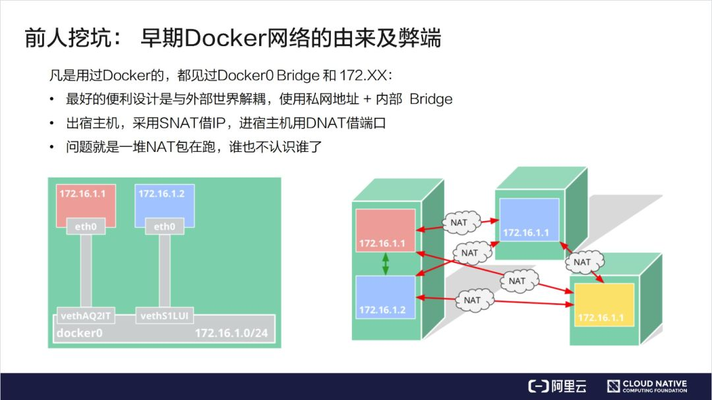

容器网络发端于 Docker 的网络。Docker 使用了一个比较简单的网络模型，即内部的网桥加内部的保留 IP。这种设计的好处在于容器的网络和外部世界是解耦的，无需占用宿主机的 IP 或者宿主机的资源，完全是虚拟的。
它的设计初衷是：当需要访问外部世界时，会采用 SNAT 这种方法来借用 Node 的 IP 去访问外面的服务。比如容器需要对外提供服务的时候，所用的是 DNAT 技术，也就是在 Node 上开一个端口，然后通过 iptable 或者别的某些机制，把流导入到容器的进程上以达到目的。
该模型的问题在于，外部网络无法区分哪些是容器的网络与流量、哪些是宿主机的网络与流量。比如，如果要做一个高可用的时候，172.16.1.1 和 172.16.1.2 是拥有同样功能的两个容器，此时我们需要将两者绑成一个 Group 对外提供服务，而这个时候我们发现从外部看来两者没有相同之处，它们的 IP 都是借用宿主机的端口，因此很难将两者归拢到一起。

借助的技术：

- **veth**
  Linux 下的 **veth** 是一对儿虚拟网卡设备，和我们常见的 lo 很类似。在这儿设备里，从一端发送数据后，内核会寻找该设备的另一半，所以在另外一端就能收到。不过 veth 只能解决一对一通信的问题。详情参见**轻松理解 Docker 网络虚拟化基础之 veth 设备！**
- **bridge**
  如果有很多对儿 veth 需要互相通信的话，就需要引入 **bridge** 这个虚拟交换机。各个 veth 对儿可以把一头连接在 bridge 的接口上，bridge 可以和交换机一样在端口之间转发数据，使得各个端口上的 veth 都可以互相通信。参见 **聊聊 Linux 上软件实现的“交换机” - Bridge！**
- **Namespace**
  **Namespace** 解决的是隔离性的问题。每个虚拟网卡设备、进程、socket、路由表等等网络栈相关的对象默认都是归属在 init_net 这个缺省的 namespace 中的。不过我们希望不同的虚拟化环境之间是隔离的，用 Docker 来举例，那就是不能让 A 容器用到 B 容器的设备、路由表、socket 等资源，甚至连看一眼都不可以。只有这样才能保证不同的容器之间复用资源的同时，还不会影响其它容器的正常运行。参见 **彻底弄懂 Linux 网络命名空间**

通过 veth、namespace 和 bridge 我们在一台 Linux 上就能虚拟多个网络环境出来。而且它们之间、和宿主机之间都可以互相通信。

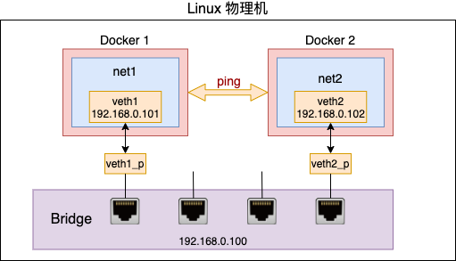

但是这个还是没能解决虚拟出来的网络环境和外部网络的通信。Linux 上提供了软件虚拟出来的二层交换机 **Bridge** 可以解决同一个宿主机上多个容器之间互连的问题，但这是不够的。二层交换无法解决容器和宿主机外部网络的互通。

还拿 Docker 容器来举例，你启动的容器里的服务肯定是需要访问外部的数据库的。还有就是可能需要暴露比如 80 端口对外提供服务。例如在 Docker 中我们通过下面的命令将容器的 80 端口上的 web 服务要能被外网访问的到。

一是从虚拟网络中访问外网，二是在虚拟网络中提供服务供外网使用。解决它们需要用到**路由**和 **nat** 技术。

### 路由

网络包在发送的时候，需要从本机的多个网卡设备中选择一个合适的发送出去。网络包在接收的时候，也需要进行路由选择，如果是属于本设备的包就往上层送到网络层、传输层直到 socket 的接收缓存区中。如果不是本设备上的包，就选择合适的设备将其转发出去。

路由在内核协议栈中的位置可以用如下一张图来表示。

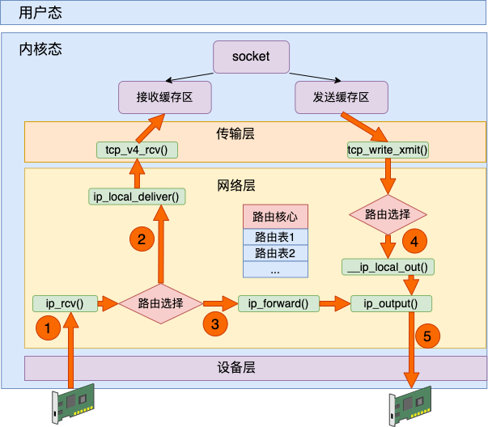

**路由查找**

发送过程调用 ip_route_output_ports 来查找路由，接收过程调用 ip_route_input_slow 来查找。但其实这两个函数都又最终会调用到 fib_lookup 这个核心函数

依次到 local 和 main 表中进行匹配，匹配到后就返回，不会继续往下匹配。从上面可以看到 **local 表的优先级要高于 main 表**，如果 local 表中找到了规则，则路由过程就结束了。

这也就是很多同学说为什么 ping 本机的时候在 eth0 上抓不到包的根本原因。所有命中 local 表的包都会被送往 loopback 设置，不会过 eth0。

路由选择过程其实不复杂，**就是根据各个路由表的配置找到合适的网卡设备（包含虚拟网卡），以及下一跳的地址**，然后把包转发出去就算是完事。

不过值得注意的是，Linux 上转发功能默认是关闭的。也就是发现目的地址不是本机 IP 地址默认是将包直接丢弃。需要做一些简单的配置，然后 Linux 才可以干像路由器一样的活儿，实现数据包的转发。

### **iptables 与 NAT**

> 参考：来，今天飞哥带你理解 iptables 原理！
> [https://mp.weixin.qq.com/s/O084fYzUFk7jAzJ2DDeADg](https://mp.weixin.qq.com/s/O084fYzUFk7jAzJ2DDeADg)

Linux 内核网络栈在运行上基本上是一个纯内核态的东西，但为了迎合各种各样用户层不同的需求，内核开放了一些口子出来供用户层来干预。其中 iptables 就是一个非常常用的干预内核行为的工具，它在内核里埋下了五个钩子入口，这就是俗称的五链。

Linux 在接收数据的时候，在 IP 层进入 ip_rcv 中处理。再执行路由判断，发现是本机的话就进入 ip_local_deliver 进行本机接收，最后送往 TCP 协议层。在这个过程中，埋了两个 HOOK，第一个是 PRE_ROUTING。这段代码会执行到 iptables 中 pre_routing 里的各种表。发现是本地接收后接着又会执行到 LOCAL_IN，这会执行到 iptables 中配置的 input 规则。

在发送数据的时候，查找路由表找到出口设备后，依次通过 __ip_local_out、 ip_output 等函数将包送到设备层。在这两个函数中分别过了 OUTPUT 和 POSTROUTING 开的各种规则。

如果是转发过程，Linux 收到数据包发现不是本机的包可以通过查找自己的路由表找到合适的设备把它转发出去。那就先是在 ip_rcv 中将包送到 ip_forward 函数中处理，最后在 ip_output 函数中将包转发出去。在这个过程中分别过了 PREROUTING、FORWARD 和 POSTROUTING 三个规则。

综上所述，iptables 里的五个链在内核网络模块中的位置就可以归纳成如下这幅图。

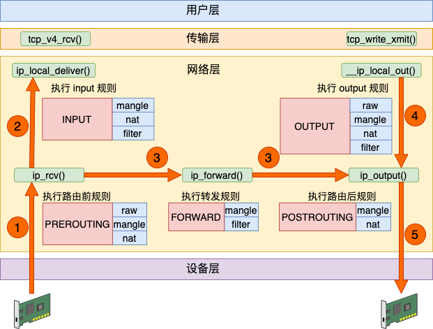

数据接收过程走的是 1 和 2，发送过程走的是 4 、5，转发过程是 1、3、5。有了这张图，我们能更清楚地理解 iptable 和内核的关系。

在 iptables 中，根据实现的功能的不同，又分成了四张表。分别是 raw、mangle、nat 和 filter。其中 nat 表实现我们常说的 NAT（Network AddressTranslation） 功能。其中 nat 又分成 SNAT（Source NAT）和 DNAT（Destination NAT）两种。

SNAT 解决的是内网地址访问外部网络的问题。它是通过在 POSTROUTING 里修改来源 IP 来实现的。

DNAT 解决的是内网的服务要能够被外部访问到的问题。它在通过 PREROUTING 修改目标 IP 实现的。

### 模拟过程

详细过程可以看飞哥的[手工模拟实现 Docker 容器网络！](https://ifs1r08y70.feishu.cn/wiki/XZhKws0x4iNx3jkfQfGcwuFFnnd?fromScene=spaceOverview)

#### 在 Docker 容器中访问外部网络

在这个过程中，我们搭建了一个虚拟网络环境，并且让这个虚拟网络可以与外部网络进行通信。总结一下整个发送过程：

1. 首先，我们创建了一个名为 net1 的网络命名空间，并在其中创建了一个 veth 对（veth1 - veth1_p）。其中，veth1_p 部分连接到宿主机的网桥 br0，而 veth1 部分放置在 net1 命名空间中，并分配了 IP 地址 192.168.0.2/24。
2. 接着，我们创建了一个名为 br0 的网桥，并给它分配了 IP 地址 192.168.0.1/24。同时，我们将 veth1_p 接口添加到网桥 br0 中，并启用了网桥 br0 和 veth1_p 接口。
3. 接下来，我们尝试从 net1 命名空间中的虚拟机访问外部网络的 IP 地址（10.153._._）。然而，由于在 net1 命名空间中没有默认路由规则，因此无法直接访问外部网络。
4. 我们使用 `ip route add default gw 192.168.0.1 veth1` 命令向 net1 命名空间中添加了一个默认路由规则，将所有不匹配其他规则的数据包发送到 veth1 接口，并指定下一跳网关为网桥 br0。
5. 尽管我们添加了默认路由规则，但数据包仍无法成功发送到外部网络。为了解决这个问题，我们需要打开转发功能并设置 NAT 规则。首先，我们启用了 IP 转发功能，使 Linux 主机可以转发收到的数据包。然后，我们使用 `iptables -t nat -A POSTROUTING -s 192.168.0.0/24 ! -o br0 -j MASQUERADE` 命令创建了一个 SNAT 规则，将 net1 命名空间中的 IP 地址（192.168.0.2）替换为宿主机的外部 IP 地址，并将数据包发送到外部网络。
6. 最后，我们再次尝试从 net1 命名空间中的虚拟机访问外部网络的 IP 地址（10.153._._），发现现在可以成功访问了。同时，通过抓包可以观察到数据包经过了宿主机的网桥和 eth0 接口，源 IP 地址已经被替换为了宿主机的外部 IP 地址。

综上所述，通过搭建虚拟网络、设置默认路由规则、启用转发功能和配置 NAT 规则，我们成功实现了在虚拟网络中访问外部网络的功能。

#### 外部可以访问 Docker 容器

1. 首先，我们在虚拟网络环境中的 net1 命名空间内启动了一个服务，监听在 192.168.0.2:80 上。
2. 接着，我们需要配置一个 DNAT 规则，将外部网络发送到宿主机的特定端口的数据包转发到 net1 命名空间内服务的 IP 地址和端口上。我们使用如下命令添加 DNAT 规则：
   iptables -t nat -A PREROUTING  ! -i br0 -p tcp -m tcp --dport 8088 -j DNAT --to-destination 192.168.0.2:80

这个命令表示，如果数据包不是来自于 br0 接口，并且目的端口是 8088，那么将其目标地址和端口转换为 192.168.0.2:80。

1. 接下来，我们从外部网络选择一个 IP（例如 10.143._._）并通过 telnet 连接到宿主机的对应端口（8088）。由于我们设置了 DNAT 规则，连接会被转发到 net1 命名空间内的服务上。
2. 我们在宿主机的 eth0 接口抓包，观察到目的 IP 和端口已经被替换为了 192.168.0.2:80。
3. 在 net1 命名空间中的服务监听到了来自外部网络的请求，并成功响应。

综上所述，通过配置 DNAT 规则，我们实现了外部网络访问虚拟网络环境中服务的功能。这种方式使得在虚拟网络环境中运行的服务能够对外提供服务，而外部网络则可以通过宿主机的转发功能来访问这些服务。

### Docker 网络模式的弊端

Docker 容器通过端口映射的方式提供对外服务。外部机器访问容器服务的时候，仍然需要通过容器的宿主机 IP 来访问。

在 Kubernets 中，对跨主网络通信有更高的要求，要**不同宿主机之间的容器可以直接互联互通**。所以 Kubernets 的网络模型也更为复杂。

## K8s 新人新气象

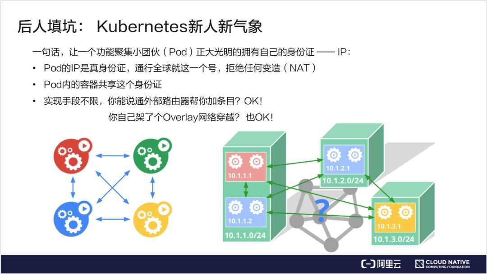

在此基础上，Kubernetes 提出了这样一种机制：即每一个 Pod，也就是一个功能聚集小团伙应有自己的“身份证”，或者说 ID。在 TCP 协议栈上，这个 ID 就是 IP。

这个 IP 是真正属于该 Pod 的，外部世界不管通过什么方法一定要给它。对这个 Pod IP 的访问就是真正对它的服务的访问，中间拒绝任何的变造。比如以 10.1.1.1 的 IP 去访问 10.1.2.1 的 Pod，结果到了 10.1.2.1 上发现，它实际上借用的是宿主机的 IP，而不是源 IP，这样是不被允许的。Pod 内部会要求共享这个 IP，从而解决了一些功能内聚的容器如何变成一个部署的原子的问题。

Pod 的 IP 在一个 K8s 的 Cluster 的所有 Node 中内部唯一。

剩下的问题是我们的部署手段。Kubernetes 对怎么实现这个模型其实是没有什么限制的，用 underlay 网络来控制外部路由器进行导流是可以的；如果希望解耦，用 overlay 网络在底层网络之上再加一层叠加网，这样也是可以的。总之，只要达到模型所要求的目的即可。

Kubernetes 对于网络具体实现方案，没有什么限制，也没有给出特别好的参考案例。Kubernetes 对一个容器网络是否合格做出了限制，也就是 Kubernetes 的容器网络模型。可以把它归结为约法三章和四大目标。

- **约法三章**的意思是：在评价一个容器网络或者设计容器网络的时候，它的准入条件。它需要满足哪三条？才能认为它是一个合格的网络方案；
- **四大目标**的意思是在设计这个网络的拓扑，设计网络的具体功能的实现的时候，要去想清楚，能不能达成连通性等这几大指标。

### **约法三章**

先来看下约法三章：

- 第一条：任意两个 Pod 之间其实是可以直接通信的，无需经过显式地使用 NAT 来接收数据和地址的转换；
- 第二条：Node 与 Pod 之间是可以直接通信的，无需使用明显的地址转换；
- 第三条：Pod 看到自己的 IP 跟别人看见它所用的 IP 是一样的，中间不能经过转换。

后文中会讲一下我个人的理解，为什么 Kubernetes 对容器网络会有一些看起来武断的模型和要求。

### **四大目标**

四大目标其实是在设计一个 K8s 的系统为外部世界提供服务的时候，从网络的角度要想清楚，外部世界如何一步一步连接到容器内部的应用？

- 外部世界和 service 之间是怎么通信的？就是有一个互联网或者是公司外部的一个用户，怎么用到 service？service 特指 K8s 里面的服务概念。
- service 如何与它后端的 pod 通讯？
- pod 和 pod 之间调用是怎么做到通信的？
- 最后就是 pod 内部容器与容器之间的通信？

最终要达到目标，就是外部世界可以连接到最里面，对容器提供服务。

> from 官方文档：[https://kubernetes.io/zh-cn/docs/concepts/services-networking/](https://kubernetes.io/zh-cn/docs/concepts/services-networking/)
>
> ### Kubernetes 网络模型
>
> 集群中每一个 `Pod` 都会获得自己的、 独一无二的 IP 地址， 这就意味着你不需要显式地在 `Pod` 之间创建链接，你几乎不需要处理容器端口到主机端口之间的映射。 这将形成一个干净的、向后兼容的模型；在这个模型里，从端口分配、命名、服务发现、 [负载均衡](https://kubernetes.io/zh-cn/docs/concepts/services-networking/ingress/#load-balancing)、 应用配置和迁移的角度来看，`Pod` 可以被视作虚拟机或者物理主机。
> Kubernetes 强制要求所有网络设施都满足以下基本要求（从而排除了有意隔离网络的策略）：
>
> - Pod 能够与所有其他[节点](https://kubernetes.io/zh-cn/docs/concepts/architecture/nodes/)上的 Pod 通信， 且不需要网络地址转译（NAT）
> - 节点上的代理（比如：系统守护进程、kubelet）可以和节点上的所有 Pod 通信
>   说明：对于支持在主机网络中运行 `Pod` 的平台（比如：Linux）， 当 Pod 挂接到节点的宿主网络上时，它们仍可以不通过 NAT 和所有节点上的 Pod 通信。
>   这个模型不仅不复杂，而且还和 Kubernetes 的实现从虚拟机向容器平滑迁移的初衷相符， 如果你的任务开始是在虚拟机中运行的，你的虚拟机有一个 IP， 可以和项目中其他虚拟机通信。这里的模型是基本相同的。
>   Kubernetes 的 IP 地址存在于 `Pod` 范围内 —— 容器共享它们的网络命名空间 —— 包括它们的 IP 地址和 MAC 地址。 这就意味着 `Pod` 内的容器都可以通过 `localhost` 到达对方端口。 这也意味着 `Pod` 内的容器需要相互协调端口的使用，但是这和虚拟机中的进程似乎没有什么不同， 这也被称为“一个 Pod 一个 IP”模型。
>   如何实现以上需求是所使用的特定容器运行时的细节。

该模型定义了：

- 每个 pod 都有自己的 IP 地址，这个 IP 在集群范围内可达
- Pod 中的所有容器共享 pod IP 地址（包括 MAC 地址），并且容器之前可以相互通信（使用 `localhost`）
- Pod 可以使用 pod IP 地址与集群中任一节点上的其他 pod 通信，无需 NAT
- Kubernetes 的组件之间可以相互通信，也可以与 pod 通信
- 网络隔离可以通过网络策略实现

上面的定义中提到了几个相关的组件：

- Pod：Kubernetes 中的 pod 有点类似虚拟机有唯一的 IP 地址，同一个节点上的 pod 共享网络和存储。
- Container：pod 是一组容器的集合，这些容器共享同一个网络命名空间。pod 内的容器就像虚拟机上的进程，进程之间可以使用 `localhost` 进行通信；容器有自己独立的文件系统、CPU、内存和进程空间。需要通过创建 Pod 来创建容器。
- Node：pod 运行在节点上，集群中包含一个或多个节点。每个 pod 的网络命名空间都会连接到节点的命名空间上，以打通网络。

**同 pod 内的容器间通信**

同 pod 内的容器间通信最简单，这些容器共享网络命名空间，每个命名空间下都有 `lo` 回环接口，可以通过 `localhost` 来完成通信。

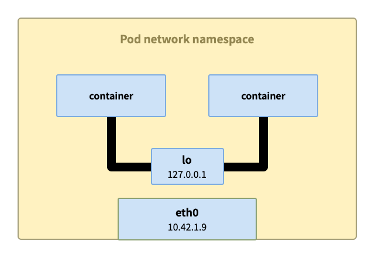

容器化以前，当需要将多个应用灵活部署到一些服务器上时，就不可避免地会遇到端口冲突问题，而协调这种冲突是很繁琐的。K8s 体系的处理方式是将每个 Pod 丢到单独的 `netns` 里，也就是 ip 和 port 都彼此隔离，这样就不需要考虑端口冲突了。

不过这套网络架构应该如何实现呢？整体来由需要解决下面这 2 个问题（结合上图的 Pod1234）：

1. Pod1 如何和 Pod2 通信（同节点）
2. Pod1 如何和 Pod3 通信（跨节点）

K8s 的网络模型要求每个 Pod 都有一个唯一的 IP 地址，即使这些 Pod 分布在不同的节点上。为了实现这个网络模型，CoreOS 团队发起了 CNI_()_ 项目（后来 CNI 进了 CNCF 孵化）。CNI (Container Network Interface) 定义了实现容器之间网络连通性和释放网络资源等相关操作的接口规范，这套接口进而由具体的 CNI 插件的去实现，CNI 插件负责为 Pod 分配 IP 地址，并处理跨节点的网络路由等具体的工作。

## **主流网络方案简介**

接下来简单介绍一下典型的容器网络实现方案。容器网络方案可能是 K8s 里最为百花齐放的一个领域，它有着各种各样的实现。容器网络的复杂性，其实在于它需要跟底层 IaaS 层的网络做协调、需要在性能跟 IP 分配的灵活性上做一些选择，这个方案是多种多样的。

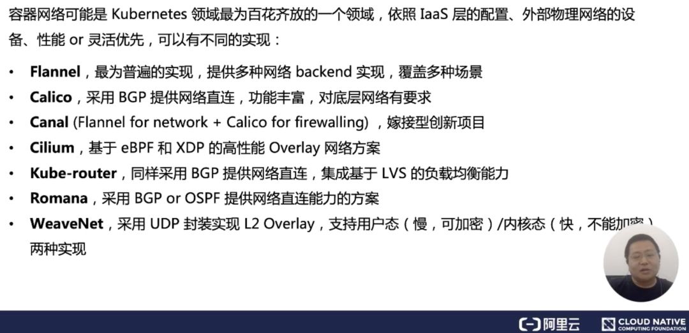

下面简单介绍几个比较主要的方案：分别是 Flannel、Calico、Canal ，最后是 WeaveNet，中间的大多数方案都是采用了跟 Calico 类似的策略路由的方法。

- **Flannel **是一个比较大一统的方案，它提供了多种的网络 backend。不同的 backend 实现了不同的拓扑，它可以覆盖多种场景；
- **Calico **主要是采用了策略路由，节点之间采用 BGP 的协议，去进行路由的同步。它的特点是功能比较丰富，尤其是对 Network Point 支持比较好，大家都知道 Calico 对底层网络的要求，一般是需要 mac 地址能够直通，不能跨二层域；
- 当然也有一些社区的同学会把 Flannel 的优点和 Calico 的优点做一些集成。我们称之为嫁接型的创新项目 **Cilium**；
- 最后讲一下 **WeaveNet**，如果大家在使用中需要对数据做一些加密，可以选择用 WeaveNet，它的动态方案可以实现比较好的加密

---

> 下面是来自于阿里云原生的这部分讲解
> [https://mp.weixin.qq.com/s/rVf2_0yefEgAyLgJgq5-kw](https://mp.weixin.qq.com/s/rVf2_0yefEgAyLgJgq5-kw)
> K8s 的主流网络插件实现原理
> K8s 中的网络是通过插件方式实现的，其网络插件有 2 种类型：
>
> - CNI 插件：遵守 CNI（Container Network Interface，容器网络接口）规范，其设计上偏重互操作性
> - Kubenet 插件：使用 bridge 和 host-local CNI 插件实现了基本的 cbr0
>
> 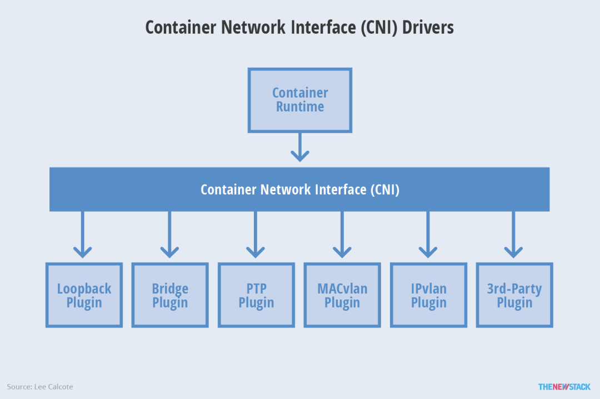
>
> 图片来自[20]，本文只关注 CNI 接口插件。主流的 K8s 网络插件有这些[21]，本文选出 github star 数在千以上的几个项目分析下：
>
> - Flannel：[https://github.com/flannel-io/flannel](https://github.com/flannel-io/flannel)
> - Calico：[https://github.com/projectcalico/calico](https://github.com/projectcalico/calico)
> - Cilium：[https://github.com/cilium/cilium](https://github.com/cilium/cilium)
>   **Flannel**
>   CNI 是由 CoreOS 提出的规范，那就先看下 CoreOS 自己的 Flannel 项目的设计。Flannel 会在每台机宿主机上部署一个名为 flanneld 的代理进程，网段相关的数据使用 Kubernetes API/Etcd 存储。Flannel 项目本身是一个框架，真正为我们提供容器网络功能的，是 Flannel 的后端实现。
>
> 目前的 Flannel 有下面几种后端实现：VXLAN、host-gw、UDP 以及阿里云和其他大厂的支持后端（云厂商都是实验性支持），还有诸如 IPIP、IPSec 等一些隧道通信的实验性支持。按照官方文档的建议是优先使用 VXLAN 模式，host-gw 推荐给经验丰富且想要进一步提升性能的用户（云环境通常不能用，原因后面说），UDP 是 Flannel 最早支持的一种性能比较差的方案，基本上已经弃用了。
>
> 下文分别对这三种模式进行分析。
> 1）VXLAN
>
> 使用 Linux 内核 VXLAN 封装数据包的方式和原理上文已经介绍过了，Flannel 创建了一个名为 flannel.1 的 VETH 设备。因为 flanneld 进程的存在，所以注册和更新新的 VETH 设备关系的任务就依靠这个进程了。所以好像也没什么需要说的了，就是每个新的 K8s Node 都会创建 flanneld 这个 DeamonSet 模式的守护进程。然后注册、更新新的 VETH 设备就变得非常自然了，全局的数据自然也是保存在 Etcd 里了。这种方式图已经画过了，无非是设备名字不一样（VETH 叫 flannel.1，网桥叫 cni0）而已。
> 2）host-gw
>
> 顾名思义，host-gw 就是把宿主机 Host 当做 Gateway 网关来处理协议包的流动。这个方式上文其实也演示过了，至于节点的变化和路由表的增删也是依靠 flanneld 在做的。这个方案优缺点都很明显，最大的优点自然是性能，实打实的直接转发（性能整体比宿主机层面的通信低 10%，VXLAN 可是 20% 起步，甚至 30%）。缺点也很明显，这种方式要求宿主机之间是二层连通的，还需要对基础设施有掌控权（编辑路由表），这个在云服务环境一般较难实现，另外规模越来越大时候的路由表规模也会随之增大。这种方式原理上比较简单，图不画了。
> 3）UDP
>
> 每台宿主机上的 flanneld 进程会创建一个默认名为 flannel0 的 Tun 设备。Tun 设备的功能非常简单，用于在内核和用户应用程序之间传递 IP 包。内核将一个 IP 包发送给 Tun 设备之后，这个包就会交给创建这个设备的应用程序。而进程向 Tun 设备发送了一个 IP 包，那么这个 IP 包就会出现在宿主机的网络栈中，然后根据路由表进行下一跳的处理。在由 Flannel 管理的容器网络里，一台宿主机上的所有容器都属于该宿主机被分配的一个“子网”。这个子网的范围信息，所属的宿主机 IP 地址都保存在 Etcd 里。flanneld 进程均监听着宿主机上的 UDP 8285 端口，相互之间通过 UDP 协议包装 IP 包给目的主机完成通信。之前说过这个模式性能差，差在哪里？这个方案就是一个在应用层模拟实现的 Overlay 网络似得（像不像一个用户态实现的 VETH 设备？），数据包相比内核原生支持的 VXLAN 协议在用户态多了一次进出（flanneld 进程封包/拆包过程），所以性能上损失要大一些。
> 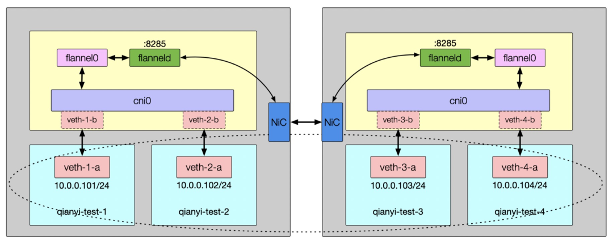
>
> ### **Calico**
>
> Calico 是个挺有意思的项目，基本思想是把宿主机完全当成路由器，不使用隧道或 NAT 来实现转发，把所有二三层流量转换成三层流量，并通过宿主机上的路由配置完成包的转发。
> Calico 和之前说的 Flannel 的 host-gw 模式区别是什么？首先 Calico 不使用网桥，而是通过路由规则在不同的 vNiC 间转发数据。另外路由表也不是靠 Etcd 存储和通知更新，而是像现实环境一样直接用 BGP（Border Gateway Protocol, 边界网关协议）进行路由表数据交换。BGP 挺复杂的，详细的阐述这个协议有点费劲（而且我也不是很懂），在本文里只需要知道这个协议使得路由设备可以相互发送和学习对方的路由信息来充实自己就可以了，有兴趣的话请查阅其他资料进一步了解。回到 Calico，宿主机上依旧有个名为 Felix 的守护进程和一个名为 BIRD 的 BGP 客户端。
> 上文说过，Flannel 的 host-gw 模式要求宿主机二层是互通的（在一个子网），在 Calico 这里依然有这个要求。但是 Calico 为不在一个子网的环境提供了 IPIP 模式的支持。开启这个模式之后，宿主机上会创建一个 Tun 设备以 IP 隧道（IP tunnel）的方式通信。当然用了这个模式之后，包又是 L3 over L3 的 Overlay 网络模式了，性能也和 VXLAN 模式相当。
> 全路由表的通信方式也没有额外组件，配置好 IP 路由转发规则后全靠内核路由模块的流转来做。IPIP 的架构图也是大同小异的，也不画了。
>
> ### **Cilium**
>
> eBPF-based Networking, Security, and Observability
> 光从这个介绍上就看出来 Cilium 散发出的那种与众不同的气息。这个项目目前的 Github Star 数字快过万了，直接力压前面两位。Cilium 部署后会在宿主机上创建一个名为 cilium-agent 的守护进程，这个进程的作用就是维护和部署 eBPF 脚本来实现所有的流量转发、过滤、诊断的事情（都不依赖 Netfilter 机制，kenel > v4.19 版本）。从原理图的角度画出来的架构图很简单（配图来自 github 主页）：
> 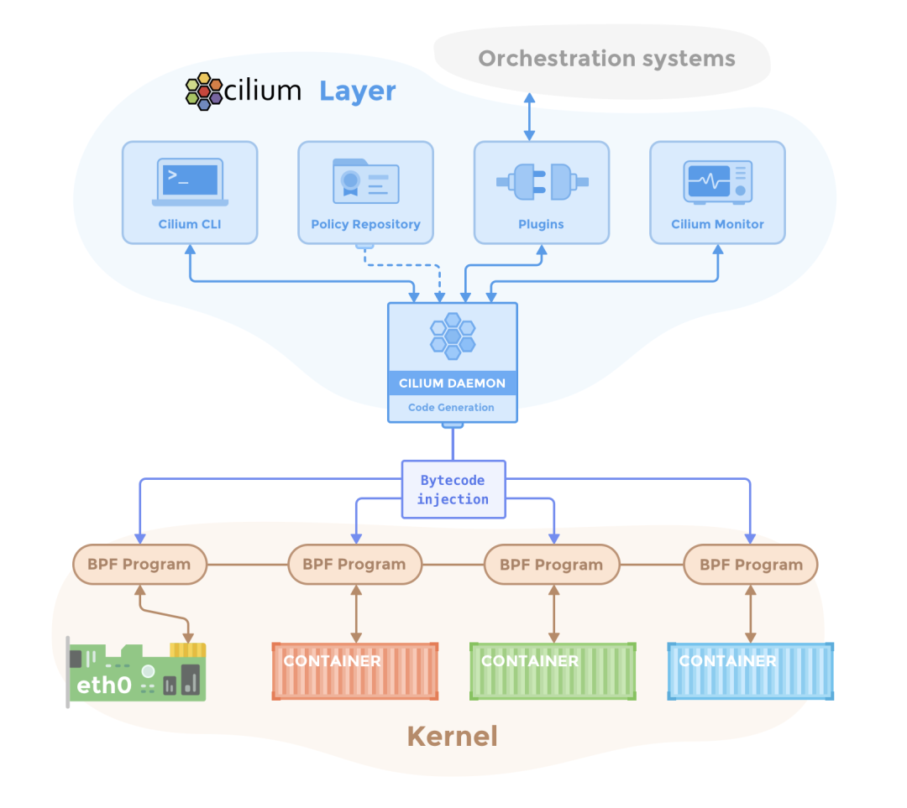
> Cilium 除了支持基本的网络连通、隔离与服务透出之外，依托 eBPF 所以对宿主机网络有更好的观测性和故障排查能力。这个话题也很大，本文就此收住。这里给两几篇写的很好的文章何其译文可以进一步了解[22][23]。

---

### **Flannel**

可以基于三种模式

- UDP
- VXLAN
- host-gw

可以参考：

> [https://lianglianglee.com/%e4%b8%93%e6%a0%8f/%e6%b7%b1%e5%85%a5%e5%89%96%e6%9e%90Kubernetes/33%20%e6%b7%b1%e5%85%a5%e8%a7%a3%e6%9e%90%e5%ae%b9%e5%99%a8%e8%b7%a8%e4%b8%bb%e6%9c%ba%e7%bd%91%e7%bb%9c.md](https://lianglianglee.com/%E4%B8%93%E6%A0%8F/%E6%B7%B1%E5%85%A5%E5%89%96%E6%9E%90Kubernetes/33%20%E6%B7%B1%E5%85%A5%E8%A7%A3%E6%9E%90%E5%AE%B9%E5%99%A8%E8%B7%A8%E4%B8%BB%E6%9C%BA%E7%BD%91%E7%BB%9C.md)
> 在本篇文章中，我为你详细讲解了 Flannel UDP 和 VXLAN 模式的工作原理。这两种模式其实都可以称作“隧道”机制，也是很多其他容器网络插件的基础。比如 Weave 的两种模式，以及 Docker 的 Overlay 模式。

行，接下来具体跟下 CNI 的 Flannel 实现是怎么工作的。

> 深入 K8s 网络原理（一）- Flannel VXLAN 模式分析
> [https://mp.weixin.qq.com/s/vluZkBHdMkkE01mP6ILBuA](https://mp.weixin.qq.com/s/vluZkBHdMkkE01mP6ILBuA)

答案：

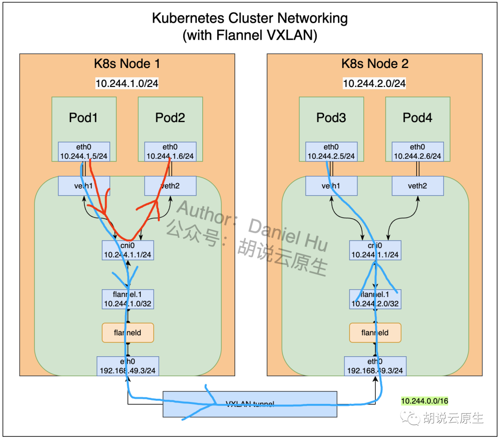

> 实际上，上面这个流程，也正是 Kubernetes 对容器网络的主要处理方法。只不过，Kubernetes 是通过一个叫作 CNI 的接口，维护了一个单独的网桥来代替 docker0。这个网桥的名字就叫作：CNI 网桥，它在宿主机上的设备名称默认是：cni0。
> 详细过程参考：
> **34 Kubernetes 网络模型与 CNI 网络插件**
> [https://lianglianglee.com/%e4%b8%93%e6%a0%8f/%e6%b7%b1%e5%85%a5%e5%89%96%e6%9e%90Kubernetes/34%20Kubernetes%e7%bd%91%e7%bb%9c%e6%a8%a1%e5%9e%8b%e4%b8%8eCNI%e7%bd%91%e7%bb%9c%e6%8f%92%e4%bb%b6.md](https://lianglianglee.com/%E4%B8%93%E6%A0%8F/%E6%B7%B1%E5%85%A5%E5%89%96%E6%9E%90Kubernetes/34%20Kubernetes%E7%BD%91%E7%BB%9C%E6%A8%A1%E5%9E%8B%E4%B8%8ECNI%E7%BD%91%E7%BB%9C%E6%8F%92%E4%BB%B6.md)

本质上就是 建立中转站（分配 IP）并且连接 + 设置转发规则，通过 CNI 的插件使用 ip 命令 add 网桥、虚拟网卡，set 路由规则。

> 在 Kubernetes 中实现跨节点间的 Pod 通信，确实涉及到了一些网络配置和规则设置，其中包括 IP 分配、转发规则等。让我们更详细地说明一下：
>
> 1. IP 分配：
>    Kubernetes 集群中的每个 Pod 都有一个唯一的 IP 地址。跨节点间的 Pod 通信需要确保每个 Pod 都能够被正确地分配到一个可用的 IP 地址。通常情况下，这由 Kubernetes 的 CNI 插件负责管理。CNI 插件负责在每个节点上创建网络命名空间、虚拟网卡等，并为每个 Pod 分配一个独立的 IP 地址。
> 2. 连接节点：
>    跨节点间的 Pod 通信需要确保各个节点之间能够互相连接。这通常通过 Kubernetes 的网络插件或者网络层面的配置来实现。Kubernetes 的网络插件负责确保节点之间的网络连通性，以便 Pod 能够在不同节点之间进行通信。
> 3. 设置转发规则：
>    在节点级别，可能需要设置一些转发规则，以确保跨节点间的 Pod 通信能够正常进行。这可能涉及使用 ip 命令设置路由表来实现。转发规则通常用于确保数据包能够正确地路由到目标 Pod，并且在必要时进行转发。
> 4. 路由配置：
>    在跨节点间的 Pod 通信中，可能需要在网络层面配置一些路由信息，以确保数据包能够正确地在节点之间进行传输。这可能涉及到设置路由表或者其他网络配置。

通过这个就可以：

1. 所有容器都可以直接使用 IP 地址与其他容器通信，而无需使用 NAT。
2. 所有宿主机都可以直接使用 IP 地址与所有容器通信，而无需使用 NAT。反之亦然。
3. 容器自己“看到”的自己的 IP 地址，和别人（宿主机或者容器）看到的地址是完全一样的。

然后在这篇里面

> **35 解读 Kubernetes 三层网络方案**
> [https://lianglianglee.com/%e4%b8%93%e6%a0%8f/%e6%b7%b1%e5%85%a5%e5%89%96%e6%9e%90Kubernetes/35%20%e8%a7%a3%e8%af%bbKubernetes%e4%b8%89%e5%b1%82%e7%bd%91%e7%bb%9c%e6%96%b9%e6%a1%88.md](https://lianglianglee.com/%E4%B8%93%E6%A0%8F/%E6%B7%B1%E5%85%A5%E5%89%96%E6%9E%90Kubernetes/35%20%E8%A7%A3%E8%AF%BBKubernetes%E4%B8%89%E5%B1%82%E7%BD%91%E7%BB%9C%E6%96%B9%E6%A1%88.md)
> 在本篇文章中，我为你详细讲述了 Fannel host-gw 模式和 Calico 这两种纯三层网络方案的工作原理。
> 需要注意的是，在大规模集群里，三层网络方案在宿主机上的路由规则可能会非常多，这会导致错误排查变得困难。此外，在系统故障的时候，路由规则出现重叠冲突的概率也会变大。
> 基于上述原因，如果是在公有云上，由于宿主机网络本身比较“直白”，我一般会推荐更加简单的 Flannel host-gw 模式。
> 但不难看到，在私有部署环境里，Calico 项目才能够覆盖更多的场景，并为你提供更加可靠的组网方案和架构思路。

## 通过 **NetworkPolicy（实际上是 iptables）实现网络隔离**

---

> 下面来自于阿里云原生：
> [https://mp.weixin.qq.com/s/rVf2_0yefEgAyLgJgq5-kw](https://mp.weixin.qq.com/s/rVf2_0yefEgAyLgJgq5-kw)
> K8s 容器内访问隔离
> 上文介绍了网络插件的机制和实现原理，最终可以构建出一个二层/三层连通的虚拟网络。默认情况下 Pod 间的任何网络访问都是不受限的，但是内部网络中经常还是需要设置一些访问规则（防火墙）的。
> 针对这个需求，K8s 抽象了一个名为 NetworkPolicy 的机制来支持这个功能。网络策略通过网络插件来实现，要使用网络策略就必须使用支持 NetworkPolicy 的网络解决方案。为什么这么说？因为不是所有的网络插件都支持 NetworkPolicy 机制，比如 Flannel 就不支持。至于 NetworkPolicy 的底层原理，自然是使用 iptables 配置 netfilter 规则来实现对包的过滤的。NetworkPolicy 配置的方法和 iptables/Netfilter 的原理细节不在本文范围内，请参阅其他资料进行了解[24][25]。

---

不难发现，Kubernetes 的网络模型，以及前面这些网络方案的实现，都只关注容器之间网络的“连通”，却并不关心容器之间网络的“隔离”。这跟传统的 IaaS 层的网络方案，区别非常明显。

你肯定会问了，Kubernetes 的网络方案对“隔离”到底是如何考虑的呢？难道 Kubernetes 就不管网络“多租户”的需求吗？

接下来，在今天这篇文章中，我就来回答你的这些问题。

在 Kubernetes 里，网络隔离能力的定义，是依靠一种专门的 API 对象来描述的，即：NetworkPolicy。

一个完整的 NetworkPolicy 对象的示例，如下所示：

```go
apiVersion: networking.k8s.io/v1
kind: NetworkPolicy
metadata:
  name: test-network-policy
  namespace: default
spec:
  podSelector:
    matchLabels:
      role: db
  policyTypes:
  - Ingress
  - Egress
  ingress:
  - from:
    - ipBlock:
        cidr: 172.17.0.0/16
        except:
        - 172.17.1.0/24
    - namespaceSelector:
        matchLabels:
          project: myproject
    - podSelector:
        matchLabels:
          role: frontend
    ports:
    - protocol: TCP
      port: 6379
  egress:
  - to:
    - ipBlock:
        cidr: 10.0.0.0/24
    ports:
    - protocol: TCP
      port: 5978
```

> 此处有省略，详细可以看
> [https://lianglianglee.com/%e4%b8%93%e6%a0%8f/%e6%b7%b1%e5%85%a5%e5%89%96%e6%9e%90Kubernetes/36%20%e4%b8%ba%e4%bb%80%e4%b9%88%e8%af%b4Kubernetes%e5%8f%aa%e6%9c%89soft%20multi-tenancy%ef%bc%9f.md](https://lianglianglee.com/%E4%B8%93%E6%A0%8F/%E6%B7%B1%E5%85%A5%E5%89%96%E6%9E%90Kubernetes/36%20%E4%B8%BA%E4%BB%80%E4%B9%88%E8%AF%B4Kubernetes%E5%8F%AA%E6%9C%89soft%20multi-tenancy%EF%BC%9F.md)

**Kubernetes 网络插件对 Pod 进行隔离，其实是靠在宿主机上生成 NetworkPolicy 对应的 iptable 规则来实现的。**

```go
**for** dstIP := **range** 所有被networkpolicy.spec.podSelector选中的Pod的IP地址
  **for** srcIP := **range** 所有被ingress.from.podSelector选中的Pod的IP地址
    **for** port, protocol := **range** ingress.ports {
      iptables -A KUBE-NWPLCY-CHAIN -s $srcIP -d $dstIP -p $protocol -m $protocol --dport $port -j ACCEPT 
    }
  }
}
```

可以看到，这是一条最基本的、通过匹配条件决定下一步动作的 iptables 规则。

这条规则的名字是 KUBE-NWPLCY-CHAIN，含义是：当 IP 包的源地址是 srcIP、目的地址是 dstIP、协议是 protocol、目的端口是 port 的时候，就允许它通过（ACCEPT）。

而正如这段伪代码所示，匹配这条规则所需的这四个参数，都是从 NetworkPolicy 对象里读取出来的。

**可以看到，Kubernetes 网络插件对 Pod 进行隔离，其实是靠在宿主机上生成 NetworkPolicy 对应的 iptable 规则来实现的。**

此外，在设置好上述“隔离”规则之后，网络插件还需要想办法，将所有对被隔离 Pod 的访问请求，都转发到上述 KUBE-NWPLCY-CHAIN 规则上去进行匹配。并且，如果匹配不通过，这个请求应该被“拒绝”。

在 CNI 网络插件中，上述需求可以通过设置两组 iptables 规则来实现。

**第一组规则，负责“拦截”对被隔离 Pod 的访问请求**。生成这一组规则的伪代码，如下所示

```go
**for** pod := range 该Node上的所有Pod {
    **if** pod是networkpolicy.spec.podSelector选中的 {
        iptables -A FORWARD -d $podIP -m physdev --physdev-**is**-bridged -j KUBE-POD-SPECIFIC-FW-CHAIN
        iptables -A FORWARD -d $podIP -j KUBE-POD-SPECIFIC-FW-CHAIN
        ...
    }
```

这里的的 iptables 规则使用到了内置链：FORWARD。

详情可看：

> 来，今天飞哥带你理解 iptables 原理！
> [https://mp.weixin.qq.com/s/O084fYzUFk7jAzJ2DDeADg](https://mp.weixin.qq.com/s/O084fYzUFk7jAzJ2DDeADg)

在这种情况下，这个 IP 包不会进入传输层，而是会继续在网络层流动，从而进入到转发路径（Forward Path）。在转发路径中，Netfilter 会设置一个名叫 FORWARD 的“检查点”。

而在 FORWARD“检查点”完成后，IP 包就会来到流出路径。而转发的 IP 包由于目的地已经确定，它就不会再经过路由，也自然不会经过 OUTPUT，而是会直接来到 POSTROUTING“检查点”。

所以说，POSTROUTING 的作用，其实就是上述两条路径，最终汇聚在一起的“最终检查点”。

需要注意的是，在有网桥参与的情况下，上述 Netfilter 设置“检查点”的流程，实际上也会出现在链路层（二层），并且会跟我在上面讲述的网络层（三层）的流程有交互。

在 iptables 里，这些标签叫作：表。比如，同样是 OUTPUT 这个“检查点”，filter Output 和 nat Output 在 iptables 里的语法和参数，就完全不一样，实现的功能也完全不同。

所以说，iptables 表的作用，就是在某个具体的“检查点”（比如 Output）上，按顺序执行几个不同的检查动作（比如，先执行 nat，再执行 filter）。

在理解了 iptables 的工作原理之后，我们再回到 NetworkPolicy 上来。这时候，前面由网络插件设置的、负责“拦截”进入 Pod 的请求的三条 iptables 规则，就很容易读懂了：

```swift
iptables -A FORWARD -d $podIP -m physdev --physdev-**is**-bridged -j KUBE-POD-SPECIFIC-FW-CHAIN
iptables -A FORWARD -d $podIP -j KUBE-POD-SPECIFIC-FW-CHAIN...
```

其中，**第一条 FORWARD 链“拦截”的是一种特殊情况**：它对应的是同一台宿主机上容器之间经过 CNI 网桥进行通信的流入数据包。其中，–physdev-is-bridged 的意思就是，这个 FORWARD 链匹配的是，通过本机上的网桥设备，发往目的地址是 podIP 的 IP 包。

> 当然，如果是像 Calico 这样的非网桥模式的 CNI 插件，就不存在这个情况了。
> kube-router 其实是一个简化版的 Calico，它也使用 BGP 来维护路由信息，但是使用 CNI bridge 插件负责跟 Kubernetes 进行交互。

而**第二条 FORWARD 链“拦截”的则是最普遍的情况，即：容器跨主通信**。这时候，流入容器的数据包都是经过路由转发（FORWARD 检查点）来的。

不难看到，这些规则最后都跳转（即：-j）到了名叫 KUBE-POD-SPECIFIC-FW-CHAIN 的规则上。它正是网络插件为 NetworkPolicy 设置的第二组规则。

而这个 KUBE-POD-SPECIFIC-FW-CHAIN 的作用，就是做出“允许”或者“拒绝”的判断。这部分功能的实现，可以简单描述为下面这样的 iptables 规则：

```css
iptables -**A** KUBE-POD-SPECIFIC-FW-CHAIN -j KUBE-NWPLCY-CHAIN
iptables -**A** KUBE-POD-SPECIFIC-FW-CHAIN -j REJECT --reject-with icmp-port-unreachable
```

可以看到，首先在第一条规则里，我们会把 IP 包转交给前面定义的 KUBE-NWPLCY-CHAIN 规则去进行匹配。按照我们之前的讲述，如果匹配成功，那么 IP 包就会被“允许通过”。

而如果匹配失败，IP 包就会来到第二条规则上。可以看到，它是一条 REJECT 规则。通过这条规则，不满足 NetworkPolicy 定义的请求就会被拒绝掉，从而实现了对该容器的“隔离”。

以上，就是 CNI 网络插件实现 NetworkPolicy 的基本方法了。当然，对于不同的插件来说，上述实现过程可能有不同的手段，但根本原理是不变的。

注意这里 iptables 的作用主要是为了隔离，和 Docker 网络那里的实现 NAT 转换的作用不同。

- Kubernetes 使用 iptables 规则来实现网络隔离，确保不同 Pod 之间的通信只能通过授权的方式进行。这种隔离可以通过网络策略（Network Policies）来定义，允许管理员控制 Pod 之间的流量。
- Docker 中的网络隔离也使用了 iptables 规则，但主要集中在 NAT 表的 MASQUERADE 规则上，用于将容器内部的 IP 地址转换为宿主机的 IP 地址，以实现容器与外部网络的通信。

## K8s Pod IP 分配机制

> 浅谈 K8s Pod IP 分配机制
> [https://mp.weixin.qq.com/s/3mIba7Mf-x8ASgImwM2rgw](https://mp.weixin.qq.com/s/3mIba7Mf-x8ASgImwM2rgw)

Pod 作为 K8s 中一等公民，其承载了最核心的 Container(s) 的运行。同时，Pod 也是 K8s 中资源调度的最小单位，因此熟悉其初始化过程（包括网络、存储、运行时等）将会使我们更加深入理解 K8s 的容器编排原理，以期更好的服务各类业务。

Pod 初始化核心流程如下：

- kube-apiserver 收到客户端请求（Controller 或 kubectl 客户端）后，创建对应的 Pod；
- kube-scheduler 按照配置的调度策略进行 Pod 调度，选择最为合适的 Node 作为目标节点；
- kubelet（运行于每个 Node 上的 K8s agent）Watch 监听到调度到所在节点的 Pod(s)，开始真正创建 Pod；
- 由 CRI 首先创建出 PodSandbox，初始化对应的网络 net namespace，**调用 CNI 获取 Pod IP；**

  > 关于 CNI 具体是什么，可以参考：**34 Kubernetes 网络模型与 CNI 网络插件**
  >

> [https://lianglianglee.com/%e4%b8%93%e6%a0%8f/%e6%b7%b1%e5%85%a5%e5%89%96%e6%9e%90Kubernetes/34%20Kubernetes%e7%bd%91%e7%bb%9c%e6%a8%a1%e5%9e%8b%e4%b8%8eCNI%e7%bd%91%e7%bb%9c%e6%8f%92%e4%bb%b6.md](https://lianglianglee.com/%E4%B8%93%E6%A0%8F/%E6%B7%B1%E5%85%A5%E5%89%96%E6%9E%90Kubernetes/34%20Kubernetes%E7%BD%91%E7%BB%9C%E6%A8%A1%E5%9E%8B%E4%B8%8ECNI%E7%BD%91%E7%BB%9C%E6%8F%92%E4%BB%B6.md)

- 接着 CRI 开始创建 Pod 中第一个 pause container，绑定到上一步创建的 net namespace 和 Pod IP；
- 接着由 CRI 依次创建和启动 Pod 中声明的 initContainers 和 containers 容器；
- 当所有的 containers 运行起来后，探针探测容器运行符合预期后，Pod 状态最终更新为 Running；

## **Service 究竟如何工作：kube-proxy 组件 + iptables 来共同实现**

Service 其实是一种负载均衡 (Load Balance) 的机制。Kubernetes 之所以需要 Service，一方面是因为 Pod 的 IP 不是固定的，另一方面则是因为一组 Pod 实例之间总会有负载均衡的需求。

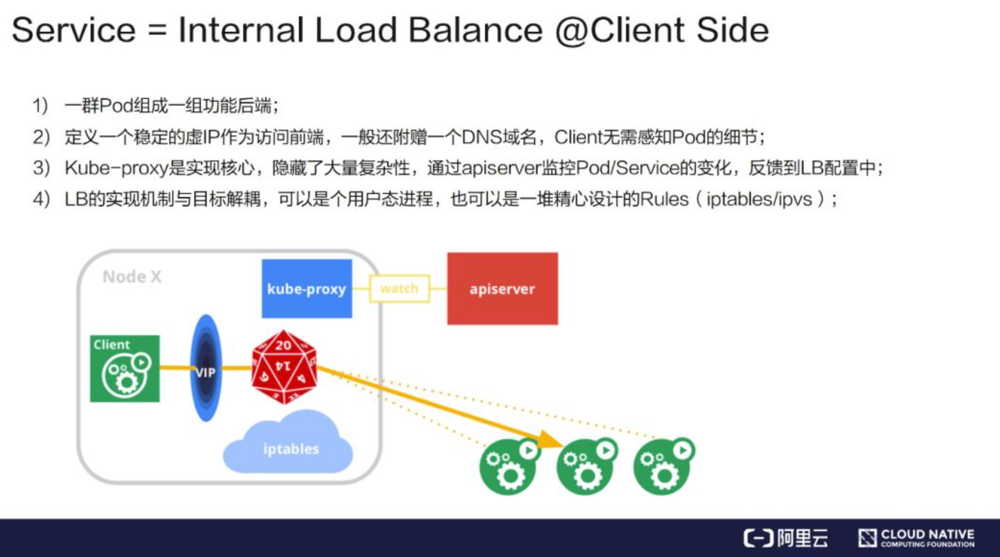

它的实现是这样的：首先是由一群 Pod 组成一组功能后端，再在前端上定义一个虚 IP 作为访问入口。一般来说，由于 IP 不太好记，我们还会附赠一个 DNS 的域名，Client 先访问域名得到虚 IP 之后再转成实 IP。Kube-proxy 则是整个机制的实现核心，它隐藏了大量的复杂性。它的工作机制是通过 apiserver 监控 Pod/Service 的变化（比如是不是新增了 Service、Pod）并将其反馈到本地的规则或者是用户态进程。

一个最典型的 Service 定义，如下所示：

```yaml
apiVersion: v1
kind: Service
metadata:
  name: hostnames
spec:
  selector:
    app: hostnames
  ports:
  - name: default
    protocol: TCP
    port: 80
    targetPort: 9376
```

这个 Service 的例子，相信你不会陌生。其中，我使用了 selector 字段来声明这个 Service 只代理携带了 app=hostnames 标签的 Pod。并且，这个 Service 的 80 端口，代理的是 Pod 的 9376 端口。

然后，我们的应用的 Deployment，如下所示：

```go
apiVersion: apps/v1
kind: Deployment
metadata:
  name: hostnames
spec:
  selector:
    matchLabels:
      app: hostnames
  replicas: 3
  template:
    metadata:
      labels:
        app: hostnames
    spec:
      containers:
      - name: hostnames
        image: k8s.gcr.io/serve_hostname
        ports:
        - containerPort: 9376
          protocol: TCP
```

这个应用的作用，就是每次访问 9376 端口时，返回它自己的 hostname。

而被 selector 选中的 Pod，就称为 Service 的 Endpoints，你可以使用 kubectl get ep 命令看到它们，如下所示：

```go
$ kubectl **get** endpoints hostnames
NAME        ENDPOINTS
hostnames   10.244.0.5:9376,10.244.0.6:9376,10.244.0.7:9376
```

需要注意的是，只有处于 Running 状态，且 readinessProbe 检查通过的 Pod，才会出现在 Service 的 Endpoints 列表里。并且，当某一个 Pod 出现问题时，Kubernetes 会自动把它从 Service 里摘除掉。

而此时，通过该 Service 的 VIP 地址 10.0.1.175，你就可以访问到它所代理的 Pod 了：

```go
$ kubectl get svc hostnames
NAME        TYPE        CLUSTER-IP   EXTERNAL-IP   PORT(S)   AGE
hostnames   ClusterIP   10.0.1.175   <none>        80/TCP    5s

$ curl 10.0.1.175:80
hostnames-0uton

$ curl 10.0.1.175:80
hostnames-yp2kp

$ curl 10.0.1.175:80
hostnames-bvc05
```

这个 VIP 地址是 Kubernetes 自动为 Service 分配的。而像上面这样，通过三次连续不断地访问 Service 的 VIP 地址和代理端口 80，它就为我们依次返回了三个 Pod 的 hostname。这也正印证了 Service 提供的是 Round Robin 方式的负载均衡。对于这种方式，我们称为：ClusterIP 模式的 Service。

你可能一直比较好奇，Kubernetes 里的 Service 究竟是如何工作的呢？

实际上，**Service 是由 kube-proxy 组件，加上 iptables 来共同实现的。**

举个例子，对于我们前面创建的名叫 hostnames 的 Service 来说，一旦它被提交给 Kubernetes，那么 kube-proxy 就可以通过 Service 的 Informer 感知到这样一个 Service 对象的添加。而作为对这个事件的响应，它就会在宿主机上创建这样一条 iptables 规则（你可以通过 iptables-save 看到它），如下所示：

```bash
-A KUBE-SERVICES -d 10.0.1.175/32 -p tcp -m comment --comment "default/hostnames: cluster IP" -m tcp --dport 80 -j KUBE-SVC-NWV5X2332I4OT4T3
```

可以看到，这条 iptables 规则的含义是：凡是目的地址是 10.0.1.175、目的端口是 80 的 IP 包，都应该跳转到另外一条名叫 KUBE-SVC-NWV5X2332I4OT4T3 的 iptables 链进行处理。

而我们前面已经看到，10.0.1.175 正是这个 Service 的 VIP。所以这一条规则，就为这个 Service 设置了一个固定的入口地址。并且，由于 10.0.1.175 只是一条 iptables 规则上的配置，并没有真正的网络设备，所以你 ping 这个地址，是不会有任何响应的。

那么，我们即将跳转到的 KUBE-SVC-NWV5X2332I4OT4T3 规则，又有什么作用呢？

实际上，它是一组规则的集合，如下所示：

```go
-A KUBE-SVC-NWV5X2332I4OT4T3 -m comment --comment "default/hostnames:" -m statistic --mode random --probability 0.33332999982 -j KUBE-SEP-WNBA2IHDGP2BOBGZ
-A KUBE-SVC-NWV5X2332I4OT4T3 -m comment --comment "default/hostnames:" -m statistic --mode random --probability 0.50000000000 -j KUBE-SEP-X3P2623AGDH6CDF3
-A KUBE-SVC-NWV5X2332I4OT4T3 -m comment --comment "default/hostnames:" -j KUBE-SEP-57KPRZ3JQVENLNBR
```

可以看到，这一组规则，实际上是一组随机模式（–mode random）的 iptables 链。

而随机转发的目的地，分别是 KUBE-SEP-WNBA2IHDGP2BOBGZ、KUBE-SEP-X3P2623AGDH6CDF3 和 KUBE-SEP-57KPRZ3JQVENLNBR。

而这三条链指向的最终目的地，其实就是这个 Service 代理的三个 Pod。所以这一组规则，就是 Service 实现负载均衡的位置。

需要注意的是，iptables 规则的匹配是从上到下逐条进行的，所以为了保证上述三条规则每条被选中的概率都相同，我们应该将它们的 probability 字段的值分别设置为 1/3（0.333…）、1/2 和 1。

这么设置的原理很简单：第一条规则被选中的概率就是 1/3；而如果第一条规则没有被选中，那么这时候就只剩下两条规则了，所以第二条规则的 probability 就必须设置为 1/2；类似地，最后一条就必须设置为 1。

你可以想一下，如果把这三条规则的 probability 字段的值都设置成 1/3，最终每条规则被选中的概率会变成多少。

通过查看上述三条链的明细，我们就很容易理解 Service 进行转发的具体原理了，如下所示：

```
-A KUBE-SEP-57KPRZ3JQVENLNBR -s 10.244.3.6/32 -m comment --comment "default/hostnames:" -j MARK --**set**-xmark 0x00004000/0x00004000
-A KUBE-SEP-57KPRZ3JQVENLNBR -p tcp -m comment --comment "default/hostnames:" -m tcp -j DNAT --**to**-destination 10.244.3.6:9376
-A KUBE-SEP-WNBA2IHDGP2BOBGZ -s 10.244.1.7/32 -m comment --comment "default/hostnames:" -j MARK --**set**-xmark 0x00004000/0x00004000
-A KUBE-SEP-WNBA2IHDGP2BOBGZ -p tcp -m comment --comment "default/hostnames:" -m tcp -j DNAT --**to**-destination 10.244.1.7:9376
-A KUBE-SEP-X3P2623AGDH6CDF3 -s 10.244.2.3/32 -m comment --comment "default/hostnames:" -j MARK --**set**-xmark 0x00004000/0x00004000
-A KUBE-SEP-X3P2623AGDH6CDF3 -p tcp -m comment --comment "default/hostnames:" -m tcp -j DNAT --**to**-destination 10.244.2.3:9376
```

可以看到，这三条链，其实是三条 DNAT 规则。但在 DNAT 规则之前，iptables 对流入的 IP 包还设置了一个“标志”（–set-xmark）。这个“标志”的作用，我会在下一篇文章再为你讲解。

而 DNAT 规则的作用，就是在 PREROUTING 检查点之前，也就是在路由之前，将流入 IP 包的目的地址和端口，改成–to-destination 所指定的新的目的地址和端口。可以看到，这个目的地址和端口，正是被代理 Pod 的 IP 地址和端口。

这样，访问 Service VIP 的 IP 包经过上述 iptables 处理之后，就已经变成了访问具体某一个后端 Pod 的 IP 包了。不难理解，这些 Endpoints 对应的 iptables 规则，正是 kube-proxy 通过监听 Pod 的变化事件，在宿主机上生成并维护的。

以上，就是 Service 最基本的工作原理。

### 基于 IPVS 模式实现

此外，你可能已经听说过，Kubernetes 的 kube-proxy 还支持一种叫作 IPVS 的模式。这又是怎么一回事儿呢？

其实，通过上面的讲解，你可以看到，kube-proxy 通过 iptables 处理 Service 的过程，其实需要在宿主机上设置相当多的 iptables 规则。而且，kube-proxy 还需要在控制循环里不断地刷新这些规则来确保它们始终是正确的。

不难想到，当你的宿主机上有大量 Pod 的时候，成百上千条 iptables 规则不断地被刷新，会大量占用该宿主机的 CPU 资源，甚至会让宿主机“卡”在这个过程中。所以说，**一直以来，基于 iptables 的 Service 实现，都是制约 Kubernetes 项目承载更多量级的 Pod 的主要障碍。**

而 IPVS 模式的 Service，就是解决这个问题的一个行之有效的方法。

IPVS 模式的工作原理，其实跟 iptables 模式类似。当我们创建了前面的 Service 之后，kube-proxy 首先会在宿主机上创建一个虚拟网卡（叫作：kube-ipvs0），并为它分配 Service VIP 作为 IP 地址，如下所示：

```go
# ip addr
  ...
  73：kube-ipvs0：<BROADCAST,NOARP>  mtu 1500 qdisc noop state DOWN qlen 1000
  link/ether  1a:ce:f5:5f:c1:4d brd ff:ff:ff:ff:ff:ff
  inet 10.0.1.175/32  scope global kube-ipvs0
  valid_lft forever  preferred_lft forever
```

而接下来，kube-proxy 就会通过 Linux 的 IPVS 模块，为这个 IP 地址设置三个 IPVS 虚拟主机，并设置这三个虚拟主机之间使用轮询模式(rr)来作为负载均衡策略。我们可以通过 ipvsadm 查看到这个设置，如下所示：

```rust
# ipvsadm -ln
 IP Virtual Server version 1.2.1 (size=4096)
  Prot LocalAddress:Port Scheduler Flags
    ->  RemoteAddress:Port           Forward  Weight ActiveConn InActConn     
  TCP  10.102.128.4:80 rr
    ->  10.244.3.6:9376    Masq    1       0          0         
    ->  10.244.1.7:9376    Masq    1       0          0
    ->  10.244.2.3:9376    Masq    1       0          0
```

可以看到，这三个 IPVS 虚拟主机的 IP 地址和端口，对应的正是三个被代理的 Pod。

这时候，任何发往 10.102.128.4:80 的请求，就都会被 IPVS 模块转发到某一个后端 Pod 上了。

而相比于 iptables，IPVS 在内核中的实现其实也是基于 Netfilter 的 NAT 模式，所以在转发这一层上，理论上 IPVS 并没有显著的性能提升。但是，IPVS 并不需要在宿主机上为每个 Pod 设置 iptables 规则，而是把对这些“规则”的处理放到了内核态，从而极大地降低了维护这些规则的代价。这也正印证了我在前面提到过的，“将重要操作放入内核态”是提高性能的重要手段。

备注：这里你可以再回顾下第 33 篇文章《深入解析容器跨主机网络》中的相关内容。

不过需要注意的是，IPVS 模块只负责上述的负载均衡和代理功能。而一个完整的 Service 流程正常工作所需要的包过滤、SNAT 等操作，还是要靠 iptables 来实现。只不过，这些辅助性的 iptables 规则数量有限，也不会随着 Pod 数量的增加而增加。

所以，在大规模集群里，我非常建议你为 kube-proxy 设置–proxy-mode=ipvs 来开启这个功能。它为 Kubernetes 集群规模带来的提升，还是非常巨大的。

---

> 下面是另一个说法，来自于：从零开始入门 K8s | Kubernetes 网络模型进阶
> [https://mp.weixin.qq.com/s/Jm8VynGd506wN5-yiLHzdg](https://mp.weixin.qq.com/s/Jm8VynGd506wN5-yiLHzdg)

我们来实际做一个 LVS 版的 Service。LVS 是一个专门用于负载均衡的内核机制。它工作在第四层，性能会比用 iptable 实现好一些。

假设我们是一个 Kube-proxy，拿到了一个 Service 的配置，如下图所示：它有一个 Cluster IP，在该 IP 上的端口是 9376，需要反馈到容器上的是 80 端口，还有三个可工作的 Pod，它们的 IP 分别是 10.1.2.3, 10.1.14.5, 10.1.3.8。

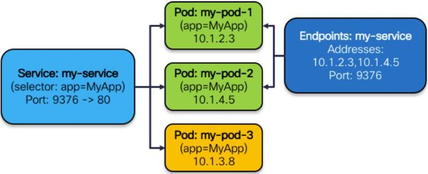

它要做的事情就是：

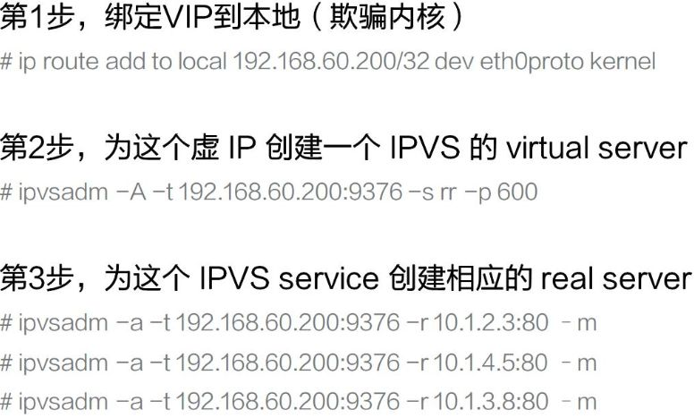

- 第 1 步，绑定 VIP 到本地（欺骗内核）；

首先需要让内核相信它拥有这样的一个虚 IP，这是 LVS 的工作机制所决定的，因为它工作在第四层，并不关心 IP 转发，只有它认为这个 IP 是自己的才会拆到 TCP 或 UDP 这一层。在第一步中，我们将该 IP 设到内核中，告诉内核它确实有这么一个 IP。实现的方法有很多，我们这里用的是 ip route 直接加 local 的方式，用 Dummy 哑设备上加 IP 的方式也是可以的。

- 第 2 步，为这个虚 IP 创建一个 IPVS 的 virtual server；

告诉它我需要为这个 IP 进行负载均衡分发，后面的参数就是一些分发策略等等。virtual server 的 IP 其实就是我们的 Cluster IP。

- 第 3 步，为这个 IPVS service 创建相应的 real server。

我们需要为 virtual server 配置相应的 real server，就是真正提供服务的后端是什么。比如说我们刚才看到有三个 Pod，于是就把这三个的 IP 配到 virtual server 上，完全一一对应过来就可以了。Kube-proxy 工作跟这个也是类似的。只是它还需要去监控一些 Pod 的变化，比如 Pod 的数量变成 5 个了，那么规则就应变成 5 条。如果这里面某一个 Pod 死掉了或者被杀死了，那么就要相应地减掉一条。又或者整个 Service 被撤销了，那么这些规则就要全部删掉。所以它其实做的是一些管理层面的工作。

## K8s 容器内服务透出

---

下文来自于：[https://mp.weixin.qq.com/s/Jm8VynGd506wN5-yiLHzdg](https://mp.weixin.qq.com/s/Jm8VynGd506wN5-yiLHzdg)

最后我们介绍一下 Service 的类型，可以分为以下 4 类。

**ClusterIP（这种不算服务透出，只算是访问 service 的一种方式）**

集群内部的一个虚拟 IP，这个 IP 会绑定到一堆服务的 Group Pod 上面，这也是默认的服务方式。它的缺点是这种方式只能在 Node 内部也就是集群内部使用。

1. **NodePort**

供集群外部调用。将 Service 承载在 Node 的静态端口上，端口号和 Service 一一对应，那么集群外的用户就可以通过 NodeIP: NodePort 的方式调用到 Service。

1. **LoadBalancer**

给云厂商的扩展接口。像阿里云、亚马逊这样的云厂商都是有成熟的 LB 机制的，这些机制可能是由一个很大的集群实现的，为了不浪费这种能力，云厂商可通过这个接口进行扩展。它首先会自动创建 NodePort 和 ClusterIP 这两种机制，云厂商可以选择直接将 LB 挂到这两种机制上，或者两种都不用，直接把 Pod 的 RIP 挂到云厂商的 ELB 的后端也是可以的。

1. **ExternalName**

摈弃内部机制，依赖外部设施，比如某个用户特别强，他觉得我们提供的都没什么用，就是要自己实现，此时一个 Service 会和一个域名一一对应起来，整个负载均衡的工作都是外部实现的。

下图是一个实例。它灵活地应用了 ClusterIP、NodePort 等多种服务方式，又结合了云厂商的 ELB，变成了一个很灵活、极度伸缩、生产上真正可用的一套系统。

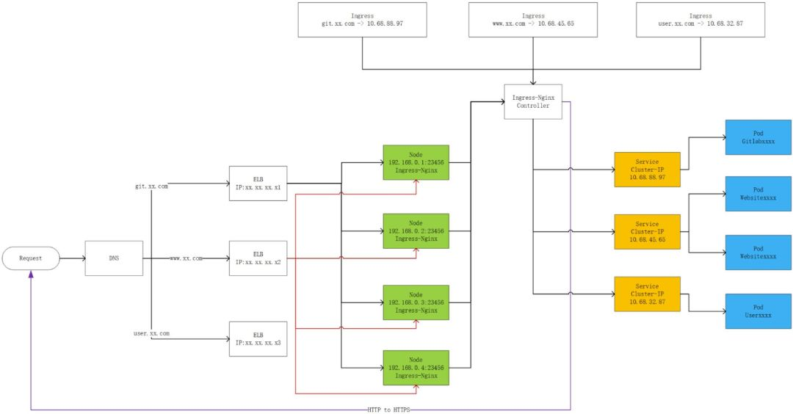

首先我们用 ClusterIP 来做功能 Pod 的服务入口。大家可以看到，如果有三种 Pod 的话，就有三个 Service Cluster IP 作为它们的服务入口。这些方式都是 Client 端的，如何在 Server 端做一些控制呢？

首先会起一些 Ingress 的 Pod（Ingress 是 K8s 后来新增的一种服务，本质上还是一堆同质的 Pod），然后将这些 Pod 组织起来，暴露到一个 NodePort 的 IP，K8s 的工作到此就结束了。

任何一个用户访问 23456 端口的 Pod 就会访问到 Ingress 的服务，它的后面有一个 Controller，会把 Service IP 和 Ingress 的后端进行管理，最后会调到 ClusterIP，再调到我们的功能 Pod。前面提到我们去对接云厂商的 ELB，我们可以让 ELB 去监听所有集群节点上的 23456 端口，只要在 23456 端口上有服务的，就认为有一个 Ingress 的实例在跑。

整个的流量经过外部域名的一个解析跟分流到达了云厂商的 ELB，ELB 经过负载均衡并通过 NodePort 的方式到达 Ingress，Ingress 再通过 ClusterIP 调用到后台真正的 Pod。这种系统看起来比较丰富，健壮性也比较好。任何一个环节都不存在单点的问题，任何一个环节也都有管理与反馈。

---

这部分来自于阿里云原生：一文理解 K8s 容器网络虚拟化

[https://mp.weixin.qq.com/s/rVf2_0yefEgAyLgJgq5-kw](https://mp.weixin.qq.com/s/rVf2_0yefEgAyLgJgq5-kw)

K8s 容器内服务透出

在一个 K8s 集群内部，在网络插件的帮助下，所有的容器/进程可以相互进行通信。但是作为服务提供方这是不够的，因为很多时候，服务的使用方不会在同一个 K8s 集群内的。那么就需要一种机制将这个集群内的服务对外透出。K8s 使用 Service 这个对象来完成这个能力的抽象。Service 在 K8s 里是个很重要的对象，即使在 K8s 内部进行访问，往往也是需要 Service 包装的（一来 Pod 地址不是永远固定的，二来总是会有负载均衡的需求）。

一句话概括 Service 的原理就是：Service = kube-proxy + iptables 规则。当一个 Service 创建时，K8s 会为其分配一个 Cluster IP 地址。这个地址其实是个 VIP，并没有一个真实的网络对象存在。这个 IP 只会存在于 iptables 规则里，对这个 VIP:VPort 的访问使用 iptables 的随机模式规则指向了一个或者多个真实存在的 Pod 地址（DNAT），这个是 Service 最基本的工作原理。那 kube-proxy 做什么？kube-proxy 监听 Pod 的变化，负责在宿主机上生成这些 NAT 规则。这个模式下 kube-proxy 不转发流量，kube-proxy 只是负责疏通管道。

K8s 官方文档比较好的介绍了 kube-proxy 支持的多种模式和基本的原理[26]。早先的 userspace 模式基本上弃用了，上面所述的 iptables 随机规则的做法在大规模下也不推荐使用了（想想为什么）。现在最推荐的当属 IPVS 模式了，相对于前两种在大规模下的性能更好。如果说 IPVS 这个词比较陌生的话，LVS 这个词恐怕是我们耳熟能详的。在这个模式下，kube-proxy 会在宿主机上创建一个名为 kube-ipvs0 的虚拟网卡，然后分配 Service VIP 作为其 IP 地址。最后 kube-proxy 使用内核的 IPVS 模块为这个地址设置后端 POD 的地址（ipvsadm 命令可以查看）。其实 IPVS 在内核中的实现也是用了 Netfilter 的 NAT 机制。不同的是，IPVS 不会为每一个地址设置 NAT 规则，而是把这些规则的处理放到了内核态，保证了 iptables 规则的数量基本上恒定，比较好的解决了之前的问题。
上面说的只是解决了负载均衡的问题，还没提到服务透出。K8s 服务透出的方式主要有 NodePort、LoadBalancer 类型的 Service（会调用 CloudProvider 在公有云上为你创建一个负载均衡服务）以及 ExternalName（kube-dns 里添加 CNAME）的方式。对于第二种类型，当 Service 繁多但是又流量很小的情况下，也可以使用 Ingress 这个 Service 的 Service 来收敛掉[27]。Ingress 目前只支持七层 HTTP(S) 转发（Service 目前只支持四层转发），从这个角度猜猜 Ingress 怎么实现的？来张图看看吧[28]（当然还有很多其他的 Controller[29]）：

---

还有一个来自于张磊的 **38 从外界连通 Service 与 Service 调试“三板斧”**

[https://lianglianglee.com/%e4%b8%93%e6%a0%8f/%e6%b7%b1%e5%85%a5%e5%89%96%e6%9e%90Kubernetes/38%20%e4%bb%8e%e5%a4%96%e7%95%8c%e8%bf%9e%e9%80%9aService%e4%b8%8eService%e8%b0%83%e8%af%95%e2%80%9c%e4%b8%89%e6%9d%bf%e6%96%a7%e2%80%9d.md](https://lianglianglee.com/%E4%B8%93%E6%A0%8F/%E6%B7%B1%E5%85%A5%E5%89%96%E6%9E%90Kubernetes/38%20%E4%BB%8E%E5%A4%96%E7%95%8C%E8%BF%9E%E9%80%9AService%E4%B8%8EService%E8%B0%83%E8%AF%95%E2%80%9C%E4%B8%89%E6%9D%BF%E6%96%A7%E2%80%9D.md)

在上一篇文章中，我为你介绍了 Service 机制的工作原理。通过这些讲解，你应该能够明白这样一个事实：Service 的访问信息在 Kubernetes 集群之外，其实是无效的。

这其实也容易理解：所谓 Service 的访问入口，其实就是每台宿主机上由 kube-proxy 生成的 iptables 规则，以及 kube-dns 生成的 DNS 记录。而一旦离开了这个集群，这些信息对用户来说，也就自然没有作用了。

所以，在使用 Kubernetes 的 Service 时，一个必须要面对和解决的问题就是：**如何从外部（Kubernetes 集群之外），访问到 Kubernetes 里创建的 Service？**

在本篇文章中，我为你详细讲解了从外部访问 Service 的三种方式（NodePort、LoadBalancer 和 External Name）和具体的工作原理。然后，我还为你讲述了当 Service 出现故障的时候，如何根据它的工作原理，按照一定的思路去定位问题的可行之道。

通过上述讲解不难看出，所谓 Service，其实就是 Kubernetes 为 Pod 分配的、固定的、基于 iptables（或者 IPVS）的访问入口。而这些访问入口代理的 Pod 信息，则来自于 Etcd，由 kube-proxy 通过控制循环来维护。

并且，你可以看到，Kubernetes 里面的 Service 和 DNS 机制，也都不具备强多租户能力。比如，在多租户情况下，每个租户应该拥有一套独立的 Service 规则（Service 只应该看到和代理同一个租户下的 Pod）。再比如 DNS，在多租户情况下，每个租户应该拥有自己的 kube-dns（kube-dns 只应该为同一个租户下的 Service 和 Pod 创建 DNS Entry）。

当然，在 Kubernetes 中，kube-proxy 和 kube-dns 其实也是普通的插件而已。你完全可以根据自己的需求，实现符合自己预期的 Service。

## 参考

除了在文中列出的，还参考了

- 从零开始入门 K8s | Kubernetes 网络概念及策略控制
  [https://mp.weixin.qq.com/s/kjOAlKTwaMZzVOiSuJE6fQ](https://mp.weixin.qq.com/s/kjOAlKTwaMZzVOiSuJE6fQ)
