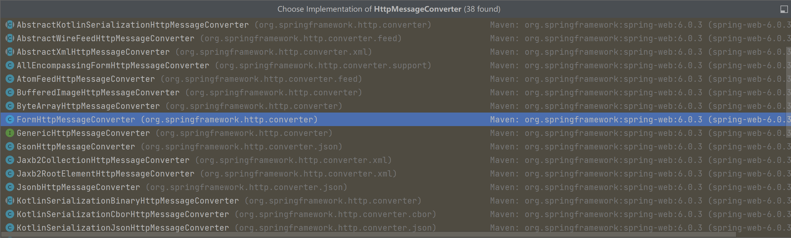

# 由 RequestBody 注解想到的

近日初学 SpringBoot 框架，Post 一个接口，返回了：

```go
2023-12-19T15:25:38.728+08:00  WARN 23508 --- [nio-8080-exec-1] .w.s.m.s.DefaultHandlerExceptionResolver : Resolved [org.springframework.web.HttpMediaTypeNotSupportedException: Content-Type 'multipart/form-data;boundary=--------------------------692495610520047406709727;charset=UTF-8' is not supported]
```

我的接口是这样的：

```go
@PostMapping("/register")
public ResponseEntity<AuthenticationResponse> register(
    @RequestBody RegisterRequest request
) {
  return ResponseEntity._ok_(service.register(request));
}

其中RegisterRequest为：
@Data
@Builder
@AllArgsConstructor
@NoArgsConstructor
public class RegisterRequest {

  private String firstname;
  private String lastname;
  private String email;
  private String password;
}
```

请求为：

```go
curl --location 'http://127.0.0.1:8080/api/v1/auth/register' \
--form 'firstname="zz"' \
--form 'lastname="zz"' \
--form 'email="2631992879@qq.com"' \
--form 'password="123456"'
```

看了下 Content-Type，根据我的表单输入，默认设置为了 multipart/form-data; boundary=calculated when request is sent

当即意识到应该用 Json 在 POST 的 payload 里面传递这些数据，像下面这样：

```go
curl --location 'http://127.0.0.1:8080/api/v1/auth/register' \
--header 'Content-Type: application/json' \
--data-raw '{
  "firstname": "zz",
  "lastname": "zz",
  "email": "2631992879@qq.com",
  "password": "123456"
}'
```

但是，我就在想，为啥我使用表单传递数据，后端就会拒绝呢？它是怎么判断我传递的什么呢？使用表单和 JSON 有啥区别呢？

先来看后端是怎么判断的。

## 我们先看下 @RequestBody 注解的源码

```go
package org.springframework.web.bind.annotation;

import java.lang.annotation.Documented;
import java.lang.annotation.ElementType;
import java.lang.annotation.Retention;
import java.lang.annotation.RetentionPolicy;
import java.lang.annotation.Target;

import org.springframework.http.converter.HttpMessageConverter;

_/**_
_ * Annotation indicating a method parameter should be bound to the body of the web request._
_ * The body of the request is passed through an {_**@link **_HttpMessageConverter} to resolve the_
_ * method argument depending on the content type of the request. Optionally, automatic_
_ * validation can be applied by annotating the argument with {_**@code **_@Valid}._
_ *_
_ * <p>Supported for annotated handler methods._
_ *_
_ * _**@author **_Arjen Poutsma_
_ * _**@since **_3.0_
_ * _**@see **_RequestHeader_
_ * _**@see **_ResponseBody_
_ * _**@see **_org.springframework.web.servlet.mvc.method.annotation.RequestMappingHandlerAdapter_
_ */_
@Target(ElementType._PARAMETER_)
@Retention(RetentionPolicy._RUNTIME_)
@Documented
public @interface RequestBody {

   _/**_
_    * Whether body content is required._
_    * <p>Default is {_**@code **_true}, leading to an exception thrown in case_
_    * there is no body content. Switch this to {_**@code **_false} if you prefer_
_    * {_**@code **_null} to be passed when the body content is {_**@code **_null}._
_    * _**@since **_3.2_
_    */_
_   _boolean required() default true;

}
```

我们看到了关键的一句话：_The body of the request is passed through an {_**@link **_HttpMessageConverter} to resolve the method argument depending on the content type of the request. _

他会根据请求的_content type，_去找到对应的 Converter，那我的原来的请求的 Content-Type 应该为 multipart/form-data，所以它应该去找 HttpMessageConverter 借口 form 相关的实现类



找到了，看下注释：

Implementation of HttpMessageConverter to read and write 'normal' HTML forms and also to write (but not read) multipart data (e.g. file uploads).

In other words, this converter can read and write the "application/x-www-form-urlencoded" media type as **MultiValueMap<String, String>**, and it can also write (but not read) the "multipart/form-data" and "multipart/mixed" media types as **MultiValueMap<String, Object>**.

总而言之，就是它会把 application/x-www-form-urlencoded 类型的数据转换为 **MultiValueMap<String, String>，**把 multipart/form-data" and "multipart/mixed"类型的，转换为** MultiValueMap<String, Object>。**

所以我们的请求理论上会在这里被转换。后面的注释就还是在解释 content type 相关的内容。

By default, "multipart/form-data" is used as the content type when writing multipart data. As of Spring Framework 5.2 it is also possible to write multipart data using other multipart subtypes such as "multipart/mixed" and "multipart/related", as long as the multipart subtype is registered as a supported media type and the desired multipart subtype is specified as the content type when writing the multipart data. Note that "multipart/mixed" is registered as a supported media type by default.

When writing multipart data, this converter uses other HttpMessageConverters to write the respective MIME parts. By default, basic converters are registered for byte array, String, and Resource. These can be overridden via setPartConverters or augmented via addPartConverter.

总之，这个 `HttpMessageConverter` 实现的作用是处理 HTML 表单数据的读写，同时支持处理多部分数据，例如文件上传。在写入多部分数据时，可以选择不同的多部分子类型，并且可以定制处理多部分数据的具体方式。知道有这么个东西就行。

由此可以看到，原生的 form 表单可以传递很多类型的数据？如何使用 HTTP 实现文件上传？这里我们留个坑，后面再探究。

我们回来继续看刚开始遇到的问题，我是用表单传输了 key:value 类型的数据

```go
--form 'firstname="zz"' \
--form 'lastname="zz"' \
--form 'email="2631992879@qq.com"' \
--form 'password="123456"'
```

这种其实应该使用 `@RequestParam` 注解

```go
@PostMapping("/register")
public ResponseEntity<AuthenticationResponse> register(
    @RequestParam("firstname") String firstname,
    @RequestParam("lastname") String lastname,
    @RequestParam("email") String email,
    @RequestParam("password") String password
) {
    // 在这里处理注册逻辑，使用接收到的参数进行操作
    // ...

    return ResponseEntity.ok(/* 返回响应 */);
}
```

是不是感觉怎么和 URL 里面携带的请求参数有点像啊？

HTML 的原生表单可以使用 POST 和 GET 方法。这两种方法指定了在提交表单时浏览器使用的 HTTP 请求方法。

- POST 方法： 通过 POST 方法提交表单时，表单数据会被包含在 HTTP 请求的消息体中，而不是作为 URL 的一部分。这通常用于向服务器提交较大量的数据，或包含敏感信息的数据，因为 POST 方法将请求体中的数据加密，而 URL 参数是以明文形式传输的。

```html
htmlCopy code
<form method="post" action="/submit"<!-- 表单内容 --></form>
```

- GET 方法： 通过 GET 方法提交表单时，**表单数据会以查询字符串的形式附加在 URL 后面**。这种方法适用于提交较小的数据，且数据不包含敏感信息。由于数据以明文形式附加在 URL 中，因此不建议用于包含敏感信息的数据。

```html
htmlCopy code
<form method="get" action="/submit"<!-- 表单内容 --></form>
```

开发者可以根据实际需求选择适当的提交方法。在处理用户登录等敏感操作时，通常会使用 POST 方法，而在搜索等不涉及敏感信息的场景中，可以使用 GET 方法。

## 那 URL 上携带的请求参数，应该使用什么注解处理呢？

URL 上携带的请求参数可以使用 `@RequestParam` 注解来处理。这个注解用于将 HTTP 请求的查询参数（query parameters）映射到方法的参数上。以下是一个简单的例子：

```java
@GetMapping("/example")
public ResponseEntity<String> example(
    @RequestParam(name = "param1", defaultValue = "default-value") String param1,
    @RequestParam(name = "param2", required = false) Integer param2
) {
    // 在这里处理逻辑，使用接收到的参数进行操作
    // ...

    return ResponseEntity.ok(/* 返回响应 */);
}
```

在这个例子中，`param1` 是一个必须的参数，如果请求中没有提供，则会使用默认值。而 `param2` 是一个可选的参数，通过 `required = false` 表示，如果请求中没有提供该参数，它将为 `null`。

## 总结 `@RequestBody` 注解

`@RequestBody` 注解是 Spring 框架中的注解，用于标识一个方法参数应该绑定到 Web 请求的主体（body）。它告诉 Spring 框架，将请求的内容体转换为方法参数的类型。这个注解主要用于处理 HTTP 请求的 POST、PUT 等方法，其中请求的数据是通过请求体（body）发送的，而不是作为 URL 参数。

具体流程如下：

1. 当一个请求到达 Spring MVC 控制器的方法时，Spring 框架会检查该方法的参数上是否有 `@RequestBody` 注解。
2. 如果发现有 `@RequestBody` 注解，Spring 框架会使用合适的 `HttpMessageConverter` 将请求体的内容转换成方法参数的类型。`HttpMessageConverter` 是一个接口，定义了如何读取请求体并写入响应体。
3. 转换后的数据会被传递给方法参数，然后你就可以在方法中处理这些数据了。

总的来说，`@RequestBody` 注解告诉 Spring 框架将请求体的内容绑定到方法的参数上，具体的绑定方式则由 `HttpMessageConverter` 实现。这使得开发者能够方便地处理各种不同类型的请求数据，例如 JSON、XML 等。

在使用 `@RequestBody` 注解时，一般需要搭配相应的消息转换器（`HttpMessageConverter`），这样 Spring 框架才能正确地解析请求体中的数据。默认情况下，Spring 提供了一些常见的消息转换器，例如处理 JSON 数据的 `MappingJackson2HttpMessageConverter`。

## 表单数据通过 multipart/form-data 和 application/x-www-form-urlencoded 传输，有啥区别？

`multipart/form-data` 和 `application/x-www-form-urlencoded` 是两种用于发送表单数据的不同 Content-Type 类型。它们的主要区别在于数据的编码方式和适用场景：

1. `application/x-www-form-urlencoded`： 这是默认的表单数据编码类型。在这种编码方式下，表单数据被编码为键值对的形式，每个键值对之间使用 "&" 符号分隔，并且空格会被编码为 "+" 或 "%20"。这种方式适用于普通的表单提交。
2. 例如，键值对 "key1=value1&key2=value2" 表示两个表单字段的数据。
3. `multipart/form-data`： 这种编码方式适用于包含文件上传的表单。在这种情况下，表单数据被划分为多个部分，每个部分都有一个唯一的标识符，同时也包含了数据的类型信息。这样可以方便地上传二进制文件等数据。
4. 这种方式的请求头会包含一个 boundary 参数，用于分隔不同的部分。
5. 例如，一个包含文本字段和文件上传字段的 `multipart/form-data` 请求可能看起来像这样：

总体而言，`application/x-www-form-urlencoded` 适用于普通表单提交，而 `multipart/form-data` 适用于包含文件上传的场景。
