# 7. 没有扛不住的流量：系统服务能力扩展 

上一篇文章我们开始讲【扩展性】方面的内容。我们提到，扩展性主要包括两个方面：

**【功能扩展】**如何快速应对业务需求，扩展系统能力。

**【服务能力扩展】**如何应对持续上涨的流量，扩展服务能力。

接着，我们从“代码扩展性”讲了【功能扩展】。我们通过两个例子来讲述“SOLID 原则”和常用的“设计模式”是如何提高代码扩展性的。并且在最后我提到，让代码拥有良好扩展性的重点在于**【具备追求优雅代码的意识】**。

今天我们就来讲扩展性的第二块内容**【服务能力扩展】**。

## 流量问题

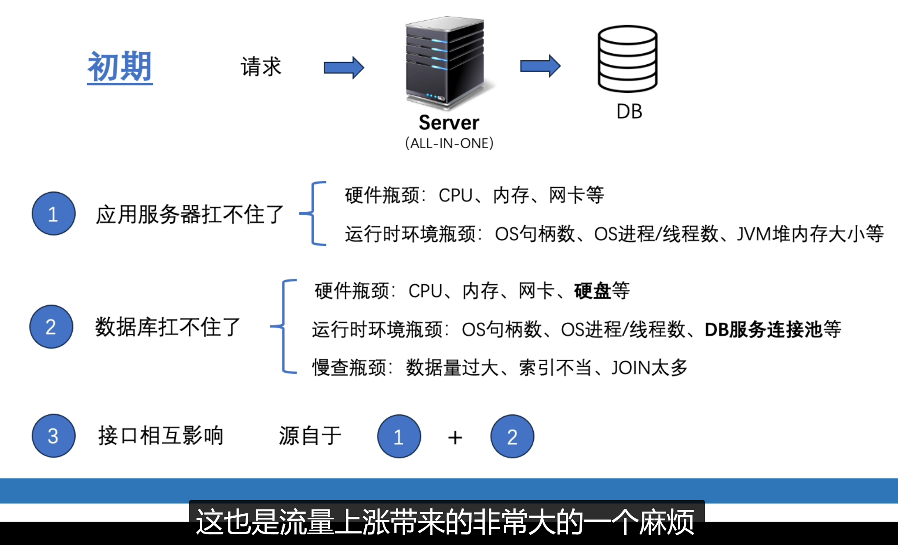

在谈“应对流量上涨”这个话题前，我们要先搞清楚流量上涨到底会带来什么问题。

_【1】最容易想到的就是应用服务器扛不住了，以至于无法提供正常的服务。也许是 cpu 资源、内存资源、带宽资源、操作系统各种资源。_

_【2】如果一个服务器提供了多种服务，其中一个服务的流量激增会“牵连”其他的服务。导致其他服务变慢或者无法正常响应。_

_【3】因为数据库进行的都是和硬盘打交道的持久化操作，效率很低。在大流量的情况下，性能问题会被急剧放大。而且，如果多个应用使用同一个库，一个应用导致数据库变慢或者资源耗尽也会影响其他应用。_

_【4】我们如果把“流量上涨”扩大到“业务量上涨”，我们可以预测数据库不仅仅是面临流量压力，数据量更是会与日俱增。数据库容量又受限于其寄生的机器上，总有硬盘耗尽的一天。_

可见，针对一个系统来说，仅仅是完成功能是远远不够的。其设计是否能够应对上面这些问题非常重要。

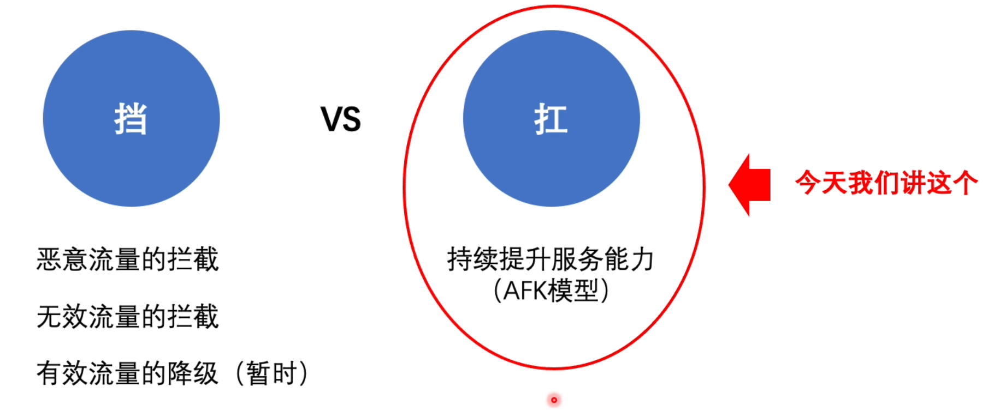

## **AFK 模型**

聊完了流量上涨带来的问题，我们就来聊聊解决方案。

针对系统扩展性有一个经典的【AFK 扩展立方体模型】，来自《架构即未来》这本书。个人认为这个模型非常不错，能够涵盖关于系统扩展性的多个维度。本文也会以这个模型体现的维度去展开对扩展性的说明。

我们先来看一下这个模型：

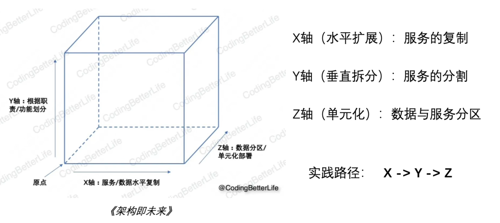

X 轴扩展称之为服务的【水平复制】。说白了，就是通过加机器的方式来应对流量的增长。

相信看到这里，有些同学会有疑问说，“通过加机器方式来扛流量”难道不是自然而然的事情吗？

当然不是，想要通过加机器来抗流量，需要具备两个先决条件，那就是【负载均衡能力】和【无状态服务设计】。

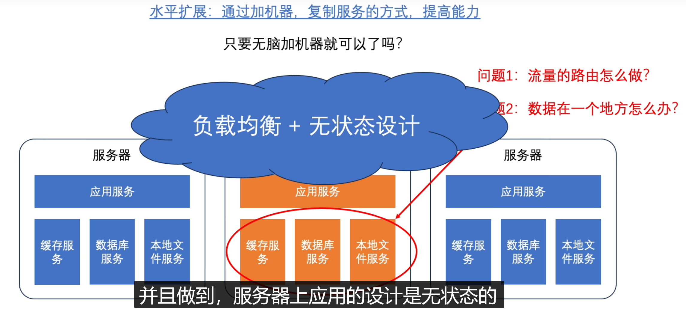

## 负载均衡

“负载均衡”是指**将流量根据一些策略分配到不同的机器上**。这个看似简单的定义背后有两个需要关注的重点。

_【1】“__负载均衡__”能够根据自适应机器的数量。只有在增加或者减少机器时，负载均衡的能力可以识别到机器数量的变化并随之调整流量，才能够实现水平复制。_

_【2】“__负载均衡__”中的“均衡”是一个具有迷惑性的字眼。这里的“均衡”并不是指平均分配流量。而是指_**根据机器的能力合适地分配流量**_。比如 2C4G 的机器和 4C8G 的机器，就可以将流量 1:2 这样来分配（能者多劳，毕竟也更贵）。_

所以，常见的负载均衡策略可能会需要考虑以下这些因素：

**【机器配置】**：机器的 core 数量和型号、内存大小、带宽配置等。

**【机器负载】**：load、cpu、io 等。

**【请求响应效率】**：qps、rt 等。

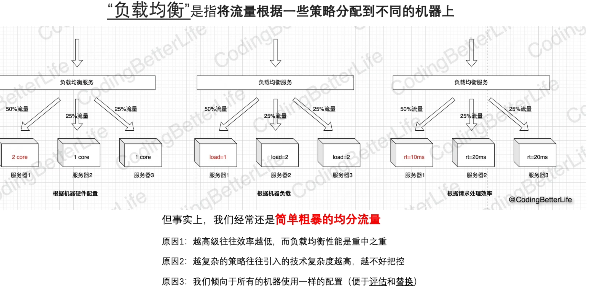

不过，这些策略看似高级，但你需要谨慎使用。因为复杂的判断逻辑必然会影响效率。例如“机器负载”和“请求响应效率”还涉及对数据的采集及分析。对于“负载均衡”来说，性能是关键。如果抛弃了性能去追求高端，那就舍本逐末了。这也是为什么很多情况下，负载均衡策略就选用轮询、随机、ip 哈希的原因。

负载均衡常使用到的技术包括：**DNS****、Nginx、LVS、注册中心等**。这些内容我们在后续架构师的篇章中会详细展开（包括四层七层、注册中心各种模式等）。我们这里仅做简要介绍。

我草，牛逼啊，确实，DNS 也可以做负载均衡。一个域名配置多个地址。妙，太妙了，纵享太庙。

【DNS】：域名解析服务，负责将网址翻译为 ip 地址。你可以在 DNS 上配置网址和多个 ip 间的映射关系。当有人上网输入了这个地址，DNS 会（轮询）选择其中一个 ip 地址返回，流量就会被均匀地分散到你的机器上。DNS 往往作为第一层负载均衡。

【Nginx】：神一般的存在。可以在四层和七层做流量的负载均衡，往往配合 DNS 在集群服务的入口承担负载均衡的职责。

【LVS】：LVS 是通过网络地址转换技术来实现负载均衡的。其工作在网络模型的四层，所以相比 nginx，他没法在七层为你提供例如改 Http Header 的事情。但其性能卓越，配置简单。同 Nginx 一样，往往用在集群入口。

【注册中心】：记录了哪些机器提供了哪些服务，并为调用方提供了服务可用的机器列表。注册中心涉及服务的注册与发现，还结合了熔断、限流等能力，往往用于集群内部服务之间 rpc 调用的负载均衡。

从上面的图我们可以看到，一个公司整个的技术架构中，到处可见”负载均衡“。

但是如果 Ng 或者 LVS 挂了怎么办呢？所以这俩人之间要使用 Keepalived 来保证负载均衡服务的高可用。

确实，注册中心也可以进行负载均衡啊，提供不同的机器地址就行了。

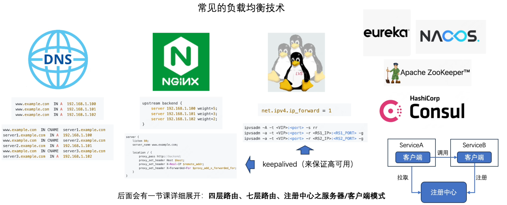

确实妙啊，注册中心还可以分发流量，屏蔽掉一些机器的地址，实现灰度。

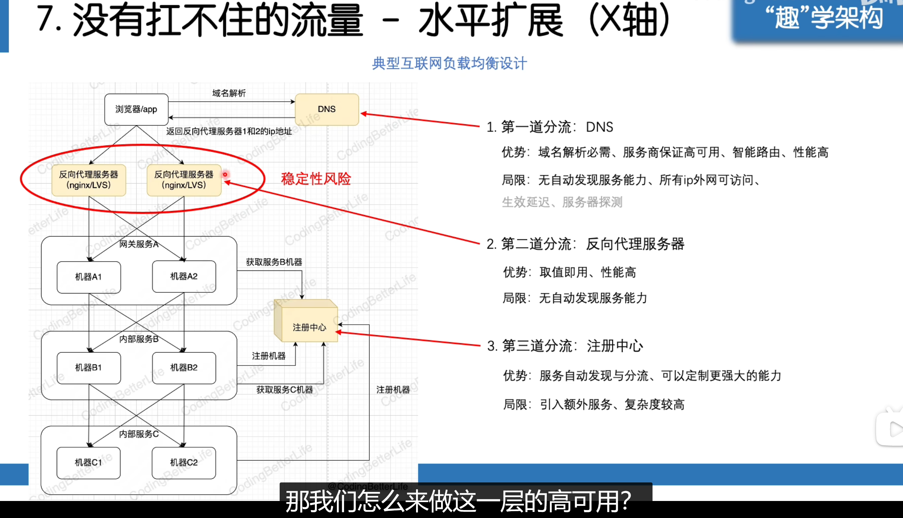

DNS 由服务商保证高可用，注册中心自己也有高可用的措施，那反向代理怎么办呢？

使用 Keepalived + 虚拟 IP 保证高可用

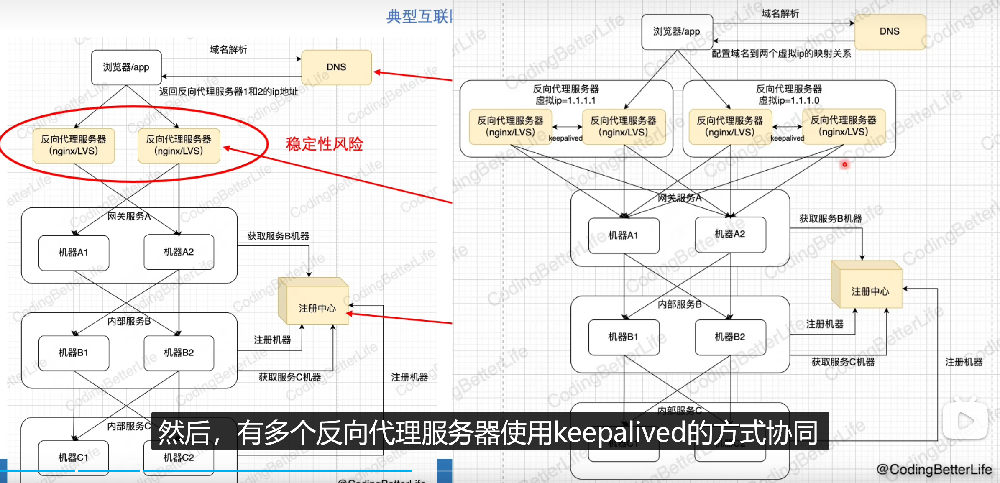

## 无状态服务设计

无状态设计是指服务器（内存或者硬盘）不存储任何持久化（或者半持久化）数据。通俗的说，每一台服务器都是没有记忆的，完全可以随时被重启、替换。_举个例子：肯德基快餐店里的员工就是无状态的。食材不是员工的，烹制食物的配方不是员工的，员工可以根据配方快速地学会烹饪食物。所以在饭店高峰期安排多一点的员工就可以抗住高流量。但是很多高级酒店就没有那么好的弹性，你需要提前预约，酒店只开放固定数量的就餐名额。这是因为餐品的烹饪是名厨自带的手艺，无法通过马上加一个厨师就可以有双倍产出。_回到系统设计，如果数据存储在本地，显而易见无法通过增加机器来快速提升服务能力。因为数据如果不先做拆分，新机器无法提供服务。同理，在缓存使用上也是一样。这样的服务，我们就称之为”有状态的服务“。面对”有状态的服务“，想要通过增加机器来扛流量，就需要做如下图这样的操作，这就引入了极大的复杂性。

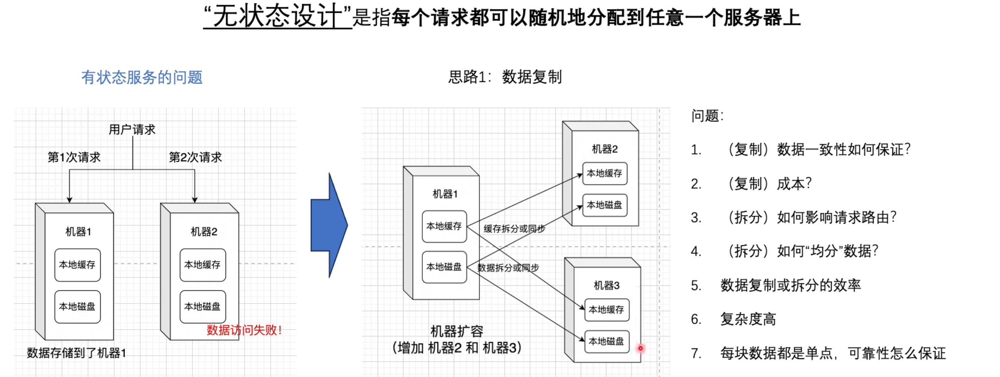

所以，要实现无状态设计，就不要依赖本地缓存和本地存储介质。改为依赖中心化的数据库服务和缓存服务。

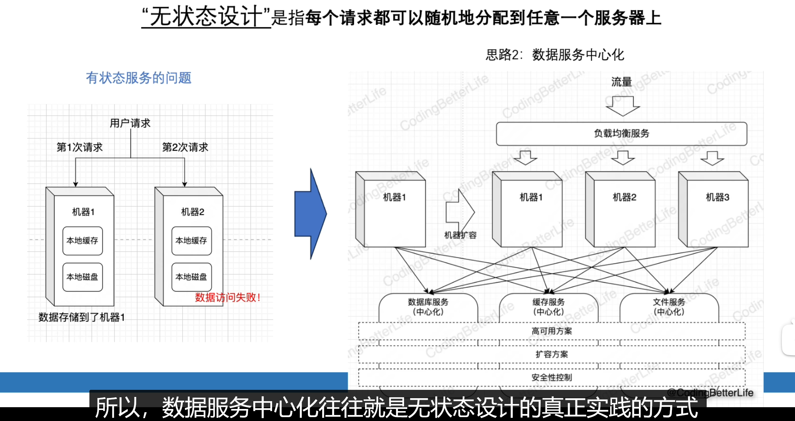

## **服务拆分（Y 轴）**

区分保障等级哈哈，不同的服务，配置不同的打电话阈值对吧，配置不同的报警级别。

也可以只对某些服务进行更新，妙啊，串起来了。

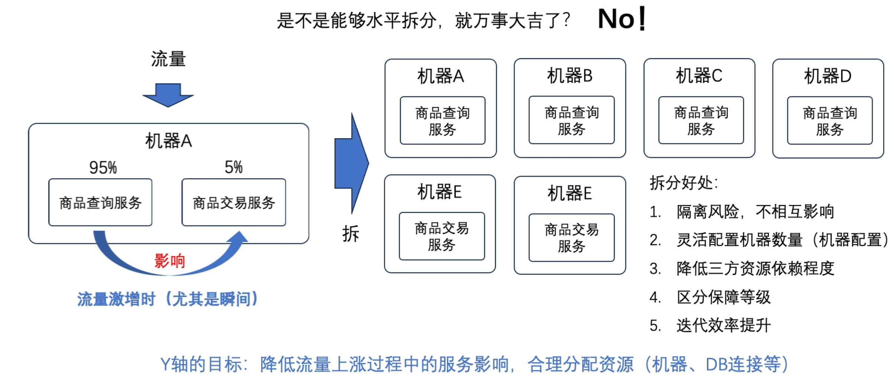

服务拆分顾名思义，就是指**把原来一个系统按照功能拆分成多个系统**。例如：

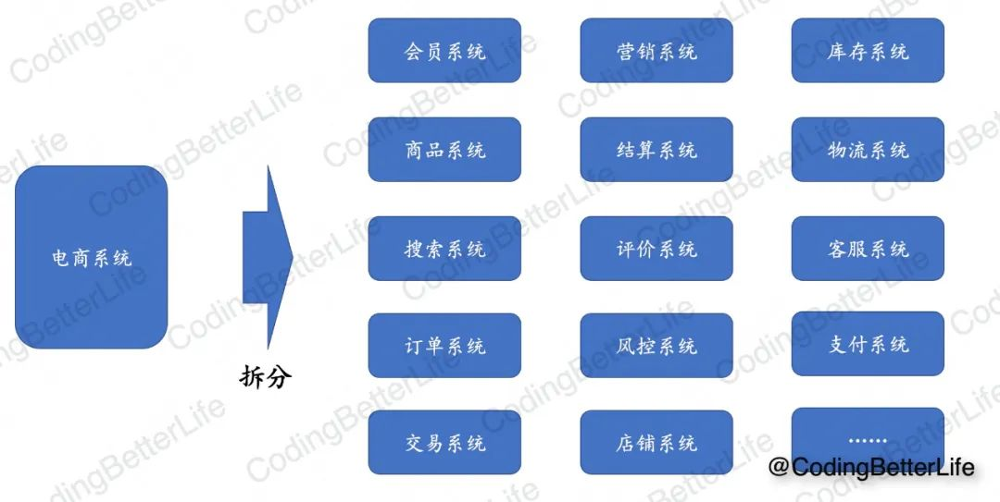

一般来说，在公司发展过程中，会先采用水平复制的方式去应对流量的增长。但是到了一定阶段后会发现一些原因，不得不做服务拆分：

_【1】运行在同一个服务器上的多个功能之前会因为流量的原因开始相互影响。_

_【2】每个功能面对的流量压力天差地别。_

上面两点是和流量相关的，但除此之外，其实还有很多原因包括：功能对机器配置或者运行时环境的配置不同、功能对存储的要求不同、功能间开发频率不同、功能都揉捏在一起测试不便、功能间的保障力度不同、团队协作耦合等各种问题。这些内容我们会在后面架构师篇章中再详细来阐述”分布式架构的优劣“。

那么问题来了，服务拆分要怎么拆呢？

### 01 设计之初要防患于未然

对于一开始没有为拆分做好准备的系统来说，拆分是非常困难的。在互联网发展初期，没有人会想到一个网站会需要承担如此大的流量，也没有人会想到一个网站的背后需要由数以百计的应用和数以千万计的服务器协同提供服务。那时候所有的代码写在一起，也就是我们常提到的 ALL-IN-ONE（所有功能在一个系统上）架构。

但是现在，即使你是创业初期，使用 ALL-IN-ONE 架构，你也应该在设计上运用现在的各种方法论，为之后的服务拆分留下可能性。

### **02 **如何让系统易于服务拆分

那我们在系统设计时注意哪些方面来提高之后服务拆分的效率呢？

这些内容其实我们在之前的几篇文章中都已经提到过了，我这边再做一个简单的陈述。

_【1】无论是层次间的依赖、模块的依赖、外部的依赖。都要遵循“依赖抽象而非具体”的原则来实现松耦合。这也是 SOLID 中的 D。_

_【2】模块功能要单一。术业有专攻，每个模块就负责一个职责。这也是 SOLID 中的 S。_

_【3】使用 DDD 的思想，定义系统中的领域模型并做好限界上下文的划分（具体 DDD 的使用可以参考《__【成为架构师】11. 成为工程师 - 如何做 DDD 领域驱动设计？__）。这里还是要强调一下的是，要完全遵循 DDD 的要求和原则是一件门槛很高的事，也可能是一件没有必要的事。重要的是你可以参考和感受 DDD 对于模块划分的思想，切记不要钻牛角尖。_

_【4】我们上面在聊水平复制时提到的“无状态设计”。_

服务拆分的过程是一个循序渐进、逐步拆分的过程，不可能“一口吃成一个胖子”，否则只会“消化不良”。

对于服务拆分的细节、系统重构的细节在后续架构师板块中会有一篇文章详细讲述。

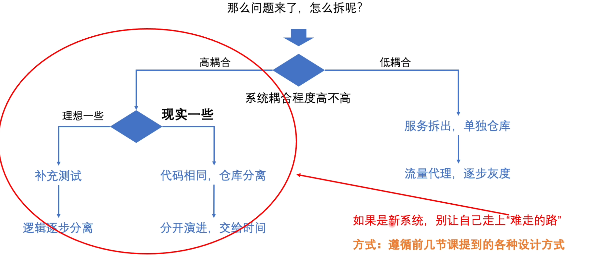

## **数据分区与单元化部署（Z 轴）**

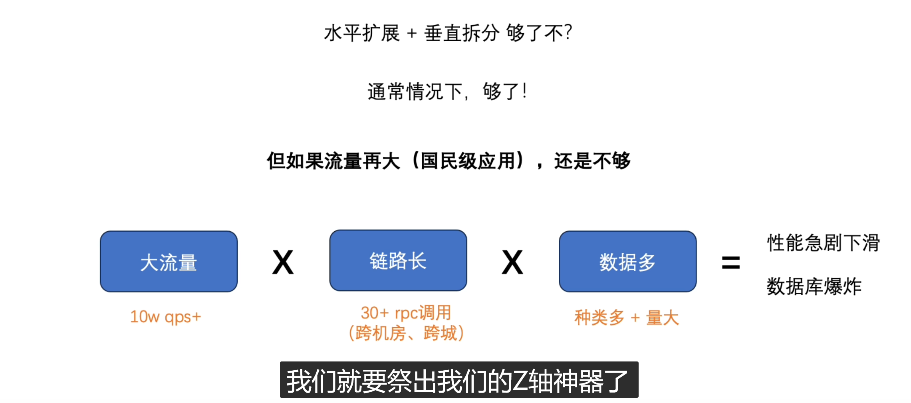

在落实【水平复制（X 轴）】和【垂直拆分（Y 轴）】后，是不是我们的系统就能够抗住持续上涨的流量了？不，接着你会碰到如下问题：

_【1】数据库的压力越来越大。一方面是业务流量带来的 CRUD 压力，另一方面是服务器水平复制后的连接数量暴涨压力，还有一方面是数据量的暴涨导致硬盘扛不住了。_

_【2】机器间__rpc__的成本越来越大。A 服务和 B 服务都有 100 台机器，其中 A37 机器在北京，B89 机器在深圳，两台机器的物理距离使得他们之间进行 rpc 调用需要一定的耗时。而一次业务请求可能涉及几十次 rpc，这些跨地域的 rpc 请求耗时累加起来就会造成严重的性能问题。更重要的是，这些 rpc 请求失败的风险也会急剧增加。_

我们怎么解决这样的问题呢？答案是：**数据拆分 + 单元化部署**。

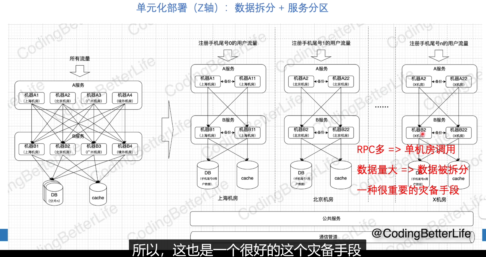

### 数据分区

顾名思义，数据分区就是**将一个数据库里的数据拆分成多份并分开部署**。

数据拆分常见的有两种：**【垂直拆分】**和**【水平拆分】**。

**【垂直拆分】**：将数据表以“列”为单位进行拆分。例如将“用户表”拆为“用户基础表”和“用户扩展表”。将用户基础信息放到“用户基础表”中，将用户扩展信息放到“用户扩展表”中。

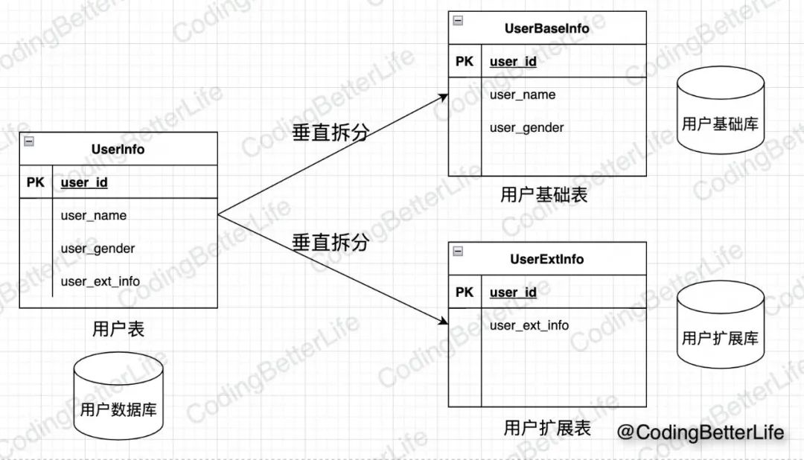

垂直拆分的思路很直观，但垂直拆分无法根治扩展性问题。如果用户数据已经拆分到最细粒度，则无法再具备扩展性。并且，垂直拆分后会带来数据访问复杂度的增加，还会带来事务问题。

**【水平拆分】**：将数据表以“行”为单位进行拆分。例如将用户表根据用户 id 的倒数两位数字进行拆分。

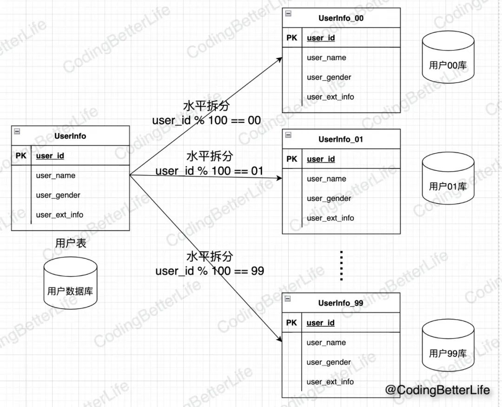

水平拆分可以做到理论上数据无限扩展。上述方案可以做到将数据均匀的拆为 100 份，如果要拆成一千份，则可以根据后三位来分库分表（前提是后三位的是均匀的）。

从上面的描述来看，水平拆分似乎明显是更优的选择，那垂直拆分有什么意义吗？

事实上，垂直拆分并不是用来解决数据容量问题的，垂直拆分更多是服务于服务拆分的。例如一开始，我们把用户的姓名、性别、出生年月、vip 等级、优惠券等信息放在一张表里。但是随着服务的拆分（用户服务拆分为用户服务、会员服务、营销服务），这些数据也要相应地做拆分。

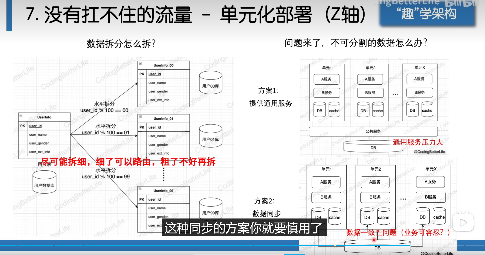

### 单元化部署

单元化部署是指：**将一整套服务镜像地部署多份，每一份称之为一个 Region**。

每一个典型的 Region 拥有这样几个特点：

_【1】有基本上所有的服务。包括业务服务（用户服务、支付服务、订单服务等等），也包括基础设施服务（消息中间件、缓存、DB）。_

_【2】数据隔离。每个 Region 的数据都是相互隔离的，包括缓存、DB 等各种数据。_

_【3】每一个 Region 中的服务都部署在一个机房内。_

_【4】每个 Region 的来源流量相互隔离。例如 RegionA 部署在深圳，负责处理所有深圳的流量。RegionB 部署在北京，处理所有来自北京的流量。_

如果你细心的话，你肯定会注意到我在【1】中用了“基本上”这三个字。这是因为有些服务无法做 Region 化，因为这些服务背后的数据是全局共享的。但是针对这样的服务我们也可以用冗余服务 + 异步化最终一致性来优化。

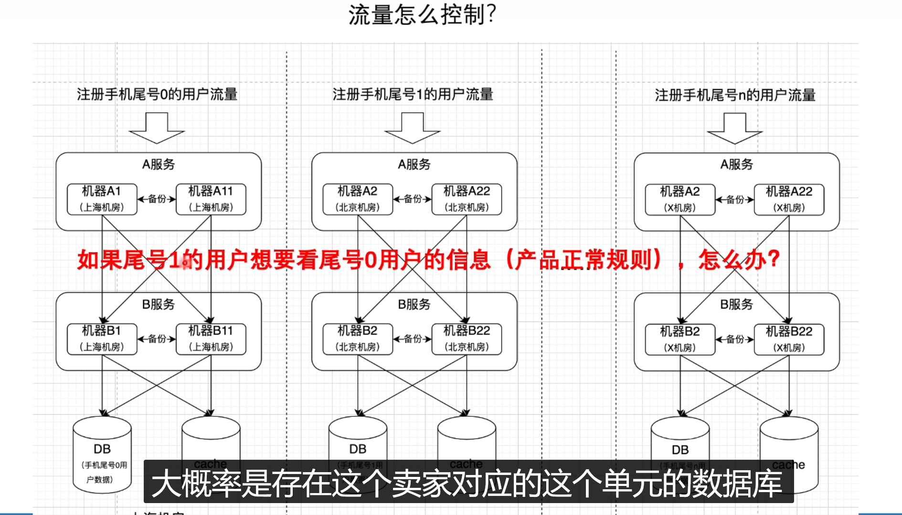

但是仍然可能会存在跨 region 调用的问题。

那也是 OK 的，因为这个单元知识逻辑隔离，物理上是联通的，就是在规则上，在要求上希望 RPC 尽可能的在单个单元内完成，但如果你有一些业务的诉求或者产品的要求一定要做跨单元的访问，也是 OK 的，物理上是联通的。

> IDC 和 LDC
> LDC（logic data center）是相对于传统的（Internet Data Center-IDC）提出的，逻辑数据中心所表达的中心思想是无论物理结构如何的分布，整个数据中心在逻辑上是协同和统一的。

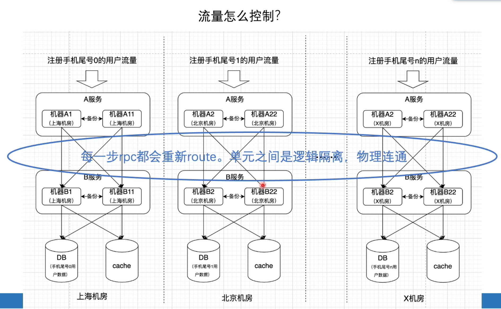

从上图中你可以看到很多“单元化”的好处。同机房服务的网络延迟基本可以忽略、某一个 Region 如果挂了不会影响另一个 Region、Region 有用完整的能力所以可以作为灾备方案等等。

坦白的说，这部分内容更多的是公司基础技术团队和运维团队在做的事情，但是**“单元化”**这种思想是非常值得学习的。

### 如何迁移到单元化部署

> 下面这个讲的太好了，其实可以抽象地理解成旧系统如何向新系统迁移，值得好好学习。[https://www.bilibili.com/video/BV1mw411X7ZK?t=3186.4](https://www.bilibili.com/video/BV1mw411X7ZK?t=3186.4)

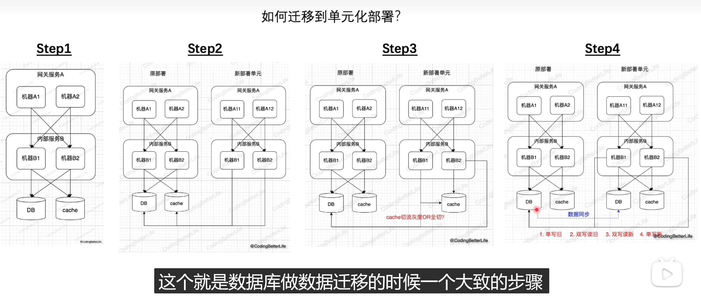

## 总结

今天我们聊了“应对持续的流量增长，我们需要如何提高系统的扩展性”。

我们先是讨论了“流量增长会带来怎样的问题”，接着我们引出了【AFK 扩展模型】，并详细展开了其描述的扩展性的三个维度【水平复制】、【服务拆分】以及【数据分区与单元化部署】。其中，前两个扩展维度和我们研发同学关联度较高，而数据分区与单元化更偏向于基础能力及运维能力。但作为技术人，我相信在面对“扩展性”这个问题时，我们不应过于强调边界。

结合上一篇文章的“代码扩展性”，我们就把“扩展性”的内容讲完了。下一篇文章开始我们一起来聊聊“性能”的话题。

加油吧，未来的架构师们！

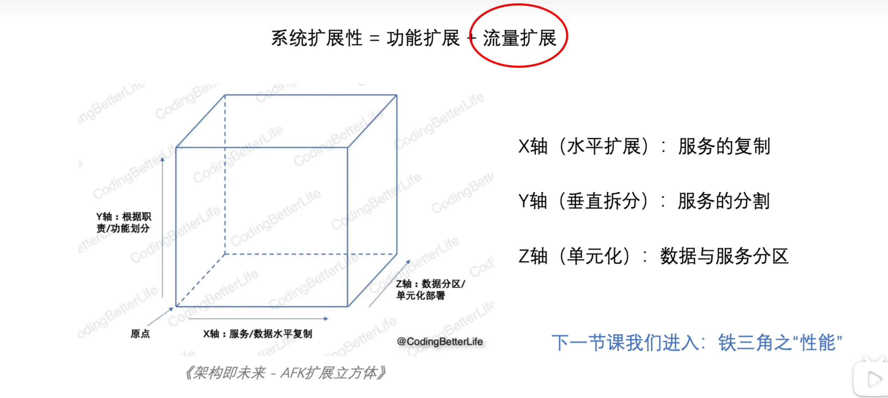

参考：[https://www.bilibili.com/video/BV1mw411X7ZK](https://www.bilibili.com/video/BV1mw411X7ZK)
